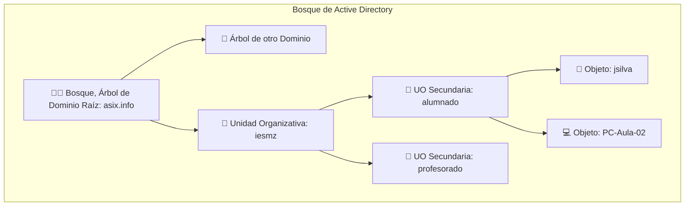
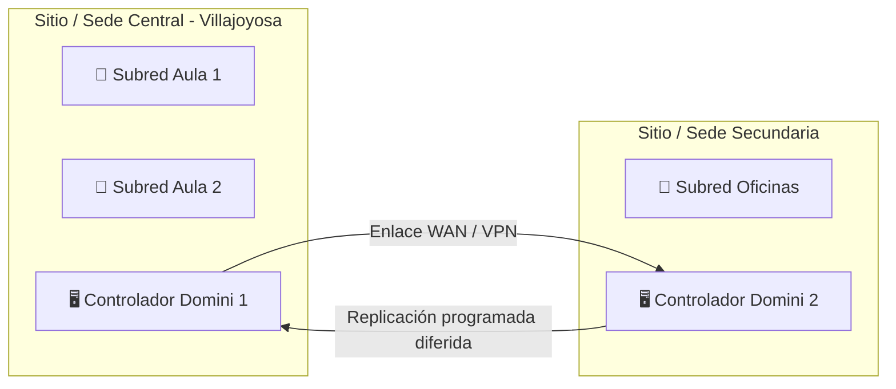
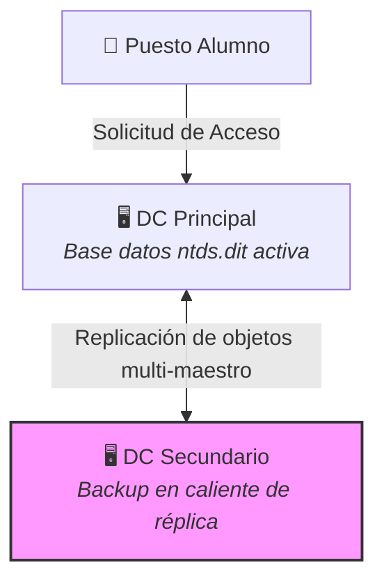

# Fundamentos de Active Directory (AD DS)

## 🎯 Relación con el Currículo (RA y CE)

* **Resultado de Aprendizaje 3 (RA3):** Administra de forma remota el sistema operativo en red valorando su importancia y aplicando criterios de seguridad.
    * **CE 3.d:** Se han aplicado directivas de seguridad para la protección del servidor y de los recursos de red.

---

## 🏢 Arquitectura y Servicios de Directorio Centralizados

En cualquier organización o empresa es habitual que los ordenadores formen parte de redes de equipos para poder intercambiar información.

Para la administración de estas redes, se pueden incluir todos los objetos que forman parte de la organización, ya sean cuentas de usuarios, equipos, aplicaciones, servicios, impresoras, carpetas compartidas, etc. dentro de un mismo ente administrativo que denominamos **Dominio** y que se suele gestionar de forma centralizada a partir de uno o varios **controladores de Dominio**.

La información de todo el dominio se almacena en una base de datos que se denomina **Directorio**.
### ¿Qué es un Servicio de Directorio?
En los entornos Microsoft Windows Server, la base de datos centralizada se crea a partir del rol de **Servicios de Dominio de Active Directory (AD DS)**. 

* **Definición de Directorio:** Una base de datos optimizada específicamente para tareas de lectura, búsqueda rápida y navegación de objetos.
* **Repositorio Único:** Funciona como un almacén unificado para toda la información relativa a las identidades de usuarios y recursos físicos o lógicos de la red.
* **Estructura Interna:** Conceptualmente, es una lista de objetos definidos mediante propiedades y atributos específicos.
* **Protocolo de Acceso:** Utiliza de forma nativa **LDAP (Lightweight Directory Access Protocol)**, un estándar ligero de comunicaciones de red diseñado para interrogar y extraer información del directorio de manera inmediata.

---

## 📐 Estructuras Lógicas de Active Directory

Las estructuras lógicas se encargan de organizar los objetos de la base de datos de manera jerárquica para simplificar la delegación y la aplicación de políticas:

### 1. Objetos (Objects)

Cualquier componente individual que forma parte del catálogo del directorio. Los objetos se clasifican fundamentalmente en tres grandes categorías operacionales:  

* **Usuarios:** Identidades que interactúan con el sistema y pueden agruparse en conjuntos de seguridad.  
* **Recursos:** Elementos del entorno a los que se concede o deniega el acceso según los privilegios del usuario (ej: estaciones de trabajo, servidores, carpetas compartidas o impresoras de red).  
* **Servicios:** Funciones y aplicaciones a las que acceden los usuarios, como el correo electrónico corporativo o herramientas web de intranet.  

### 2. Unidades Organizativas (OUs)

Son contenedores lógicos diseñados para guiar y agrupar colecciones de objetos (usuarios o equipos) pertenecientes a un mismo dominio. Constituyen el nivel lógico más utilizado por el administrador debido a sus ventajas estratégicas:  

* Permiten estructurar los recursos imitando los departamentos reales de la empresa o las aulas del instituto.  
* Facilitan la administración masiva e independiente de un subconjunto de objetos.  
* Habilitan la **delegación de autoridad administrativa**, permitiendo dar permisos de gestión básicos a ciertos usuarios o profesores sobre una UO concreta sin necesidad de concederles la contraseña de Administrador del Dominio global.  
* Son los únicos contenedores lógicos del árbol sobre los que se vinculan directamente las Políticas de Grupo (GPO).

### 3. Dominios (Domains)

Representan el subconjunto administrativo principal de la red. Comparten un directorio común, una base de datos de seguridad única y unos límites lógicos perimetrales estrictos.  

* Emplean de manera obligatoria el protocolo **DNS (Domain Name System)** para nombrar de forma única a todos los objetos integrados en la red.  
* Pueden ser de carácter **Privado** (nombres accesibles únicamente desde las LAN de la organización) o **Públicos** (registrados siguiendo los convenios de la jerarquía global de Internet).  

### 4. Árboles (Trees) y Bosques (Forests)

Cuando la infraestructura requiere segmentación avanzada, los dominios se escalan jerárquicamente:

* **Árbol:** Una colección de subdominios que dependen de un dominio raíz común y comparten un mismo espacio de nombres DNS continuo. Esto permite dividir el directorio entre subdominios sectoriales (ej: `contabilidad.granempresa.com` y `rrhh.granempresa.com`).  
* **Bosque:** Representa el mayor ámbito de seguridad y administración dentro de Active Directory. Engloba a todos los dominios y árboles de la organización, permitiendo que convivan dominios con nombres DNS completamente diferentes (ej: un holding que agrupa dominios independientes como `globalsale.com`, `all4you.com` y `specialone.com`).  

---

## ⚙️ Estructuras Físicas de Active Directory

A diferencia de las lógicas, las estructuras físicas modelan y optimizan el tráfico de comunicaciones de la base de datos basándose en la topología de red real del centro o empresa.  

* **Subredes:** Equipos configurados dentro de una misma dirección de red

La distinción de sitios permite que el sistema operativo optimice el rendimiento: los accesos dentro de un mismo sitio son inmediatos, mientras que la **replicación de datos** entre Controladores de Dominio situados en sitios diferentes se programa de forma diferida para no saturar las líneas WAN.  

---

## 🔒 Mecanismos Criptográficos de Autenticación de Red

Cuando un cliente o administrador inicia sesión o lanza herramientas remotas (como WinRM), la validación de identidades y la seguridad del catálogo global descansa sobre dos componentes internos compartidos por el bosque:

### 1. El Esquema del Directorio (Directory Schema)

Ubicado en el primer dominio raíz del bosque, contiene la descripción matemática de la estructura interna del directorio: define qué tipos de objetos se pueden crear y qué atributos o propiedades puede almacenar cada uno. El esquema es único y se replica entre todos los controladores de dominio del sistema.  

### 2. Relaciones de Confianza (Trust Relationships)

Son los puentes de seguridad lógicos que se establecen de forma automática o manual entre dominios, árboles y bosques. Permiten indicar de forma fehaciente qué usuarios de un dominio específico tienen permisos para consumir recursos de otro dominio diferente dentro del *holding* sin necesidad de duplicar sus cuentas.  

---

## 🖥️ Arquitectura de Servidores: El Controlador de Dominio (DC)

El Controlador de Dominio es el servidor encargado de hospedar físicamente la base de datos de Active Directory y gestionar la seguridad local y perimetral de su entorno.  

* **Funciones Clave:** Se encarga de autenticar de forma imperativa las identidades de los usuarios y autorizar sus accesos a los recursos compartidos de la infraestructura corporativa.  
* **Políticas de Resiliencia:** Aunque técnicamente un dominio puede operar con un único servidor activo, **es una buena práctica y recomendación estricta de producción desplegar un mínimo de dos Controladores de Dominio**. Esto garantiza alta disponibilidad y persistencia mediante réplicas exactas de *backup* ante fallos físicos del hardware o cortes de suministro.

---

## 📚 Referencias y Fuentes Consultadas

!!! info "Documentación Oficial y Autoría"
    * **Material Base:** Basado en las diapositivas e ilustraciones de la unidad *"UNIDAD 2.- Servicios de directorio en Windows. Conceptos básicos. Diseño e implementación"* desarrolladas por el Departamento de Informática del **IES Marcos Zaragoza**.
    * **Docente Catedrático / Autor:** José Ramón Soria Nieto.
    * **Grado Formativo:** Módulo profesional de *Administración de Sistemas Operativos (ASO)*, Segundo Curso del Ciclo Formativo de Grado Superior en *Administración de Sistemas Informáticos en Red (2ASIR / 2ASIX)*.  

!!! abstract "Soporte Institucional y Fondo Social Europeo"
    * **Órgano Regulador:** Generalitat Valenciana — Conselleria d'Educació, Cultura i Esport.
    * **Acreditación de Financiación:** Proyecto tecnológico cofinanciado por la **Unión Europea** a través del **Fondo Social Europeo (FSE)**.
    * *«El FSE invierte en tu futuro»* — Acciones destinadas a la digitalización avanzada, el despliegue de infraestructuras críticas en las aulas y la formación técnica especializada para entornos laborales de Formación Profesional.