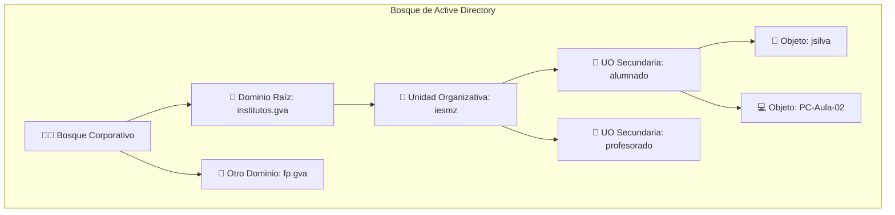
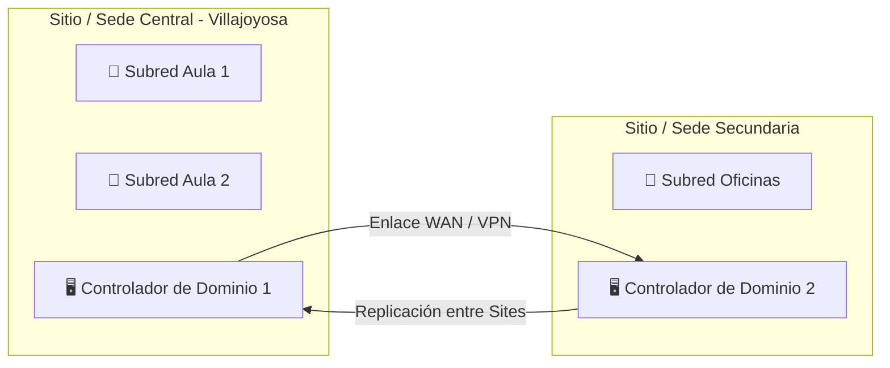
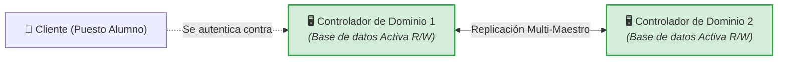

# Fundamentos de Active Directory (AD DS)

## 🎯 Relación con el Currículo (RA y CE)

* **Resultado de Aprendizaje 1 (RA1):** Administra el servicio de directorio interpretando especificaciones e integrándolo en una red.
    * **CE1-RA1:** Se han identificado la función, los elementos y las estructuras lógicas del directorio.

---

## 🏢 Arquitectura y Servicios de Directorio Centralizados

En una organización con numerosos usuarios, equipos y recursos resulta necesario disponer de mecanismos que permitan almacenar información sobre ellos y administrarlos de forma centralizada. Los servicios de directorio proporcionan precisamente esta funcionalidad, permitiendo organizar y consultar información sobre las identidades y recursos de la organización.

### ¿Qué es un Servicio de Directorio?
Un servicio de directorio se compone básicamente de un **directorio** (base de datos) y un **protocolo de acceso**. A diferencia de las bases de datos relacionales tradicionales (diseñadas para transacciones complejas de lectura y escritura), los servicios de directorio están optimizados principalmente para almacenar y consultar información de forma eficiente, especialmente información sobre identidades, recursos y su organización. En Active Directory, otros mecanismos, como Kerberos y las ACL, participan en la autenticación y autorización.

La referencia fundamental de estos servicios es la especificación **LDAP (Lightweight Directory Access Protocol)**, definida en estándares como los RFC 4510 (hoja de ruta), 4511 (protocolo) y 4512 (directorio). 

El servicio sigue normalmente una arquitectura **cliente/servidor distribuida** sobre TCP/IP. Existen diferentes servicios de directorio que utilizan LDAP, entre ellos:

* **Active Directory** de Microsoft (que analizaremos en detalle).
* **OpenLDAP** (implementación de código abierto).
* **Red Hat Directory Server**.

En los entornos Microsoft Windows Server, este servicio se implementa mediante el rol Servicios de Dominio de Active Directory (AD DS), que utiliza LDAP como uno de sus principales protocolos para acceder al directorio.

---

## 🗂️ Estructuras Lógicas de LDAP (Base de Active Directory)

Antes de hablar de los nombres propios de Active Directory, es importante entender cómo se estructura cualquier directorio LDAP. 

Cada entrada del directorio LDAP sirve para representar un usuario, un equipo o cualquier otro recurso de la red. En la práctica, y especialmente en Active Directory, a estas entradas se las denomina **objetos**. 

Cada objeto consta de tres componentes principales: un **nombre distintivo**, un conjunto de **atributos** y un conjunto de **clases de objeto**. 

El conjunto de entradas del directorio conforma la **DIB (Directory Information Base)**. 

Para organizar esta base de datos, los objetos se estructuran de forma jerárquica formando un árbol llamado **DIT (Directory Information Tree)**.

> **📌 Nota sobre Active Directory:**
> En Active Directory, la información del directorio se almacena en una base de datos denominada NTDS, cuyo archivo principal es `ntds.dit`. Conceptualmente, esta información se organiza siguiendo una estructura jerárquica similar al DIT de LDAP.

### Nomenclatura en el DIT
Cada entrada tiene un nombre que la distingue de manera única en todo el árbol, conocido como **DN (Distinguished Name)**. Los nombres se forman mediante asignaciones clave-valor a partir de los atributos.
Además, dentro del árbol, cada entrada tiene un nombre corto o relativo a su contenedor llamado **RDN (Relative Distinguished Name)**.

**Ejemplo de nomenclatura DIT:**
```text
dc=mz,dc=ies
└── ou=INFO
    └── ou=ASIX
        ├── uid=juan.perez
        └── uid=ana.lopez
```

* **Entrada de:** Juan Pérez
* **RDN (Nombre Relativo):** `uid=juan.perez`
* **DN (Nombre Completo):** `uid=juan.perez,ou=ASIX,ou=INFO,dc=mz,dc=ies`

> **📌 Nota sobre Active Directory:**
> En Active Directory, el atributo utilizado por defecto para el RDN de los usuarios es `CN` (Common Name) en lugar de `uid`. Por lo tanto, el DN equivalente en Active Directory sería:
> `CN=Juan Perez,OU=ASIX,OU=INFO,DC=mz,DC=ies`

### Atributos de los objetos y Clases de Objetos (ObjectClass)

Cada objeto del directorio tiene características que lo definen, que son los atributos y sus valores, ej: `cn=Alberto`, `mail=alberto@ies.mz`. Los atributos contienen una descripción y uno o más valores. La descripción es el tipo de atributo y cero o más opciones. Los valores se acompañan de reglas para introducirlos.

Para definir cómo se construyen estos objetos junto a sus atributos, LDAP utiliza las **Clases de Objetos (ObjectClass)**. Las clases de objeto definen qué tipo de objeto es una entrada y qué atributos puede o debe contener. Las clases pueden formar jerarquías mediante herencia y pueden complementarse mediante clases auxiliares.

Existen tres tipos de clases:

* **Estructurales:** Definen el objeto base que se va a crear (ej. un usuario).
* **Auxiliares:** Se usan para añadir funcionalidades o atributos extra a una clase estructural.
* **Abstractas:** No permiten crear objetos directamente, sino que sirven como "padres" para compartir atributos mediante **herencia**. Por ejemplo:

  ```text
  top
   └─ person
       └─ organizationalPerson
           └─ user
  ```


### El Esquema del Directorio (Directory Schema)

En cualquier directorio LDAP, el Esquema agrupa **la definición formal de todos los ObjectClass y atributos** permitidos en el directorio, dictando las reglas sobre cómo se construyen y relacionan las entradas dentro del DIT. Actúa como el plano estructural de la base de datos. **Actualizar el esquema es una tarea avanzada y crítica**, ya que cualquier inconsistencia puede suponer la interrupción del servicio LDAP. En implementaciones LDAP, las extensiones del esquema, por ejemplo, para soportar una nueva aplicación corporativa, pueden distribuirse o incorporarse mediante definiciones específicas del servidor o mediante archivos LDIF.

> **📌 Nota sobre Active Directory:** 
> Al instalar Active Directory, se despliega un esquema predefinido. Este esquema es **único para todo el bosque**, define las clases de objetos y atributos disponibles y se replica entre los controladores de dominio. Las modificaciones del esquema se realizan a través del controlador de dominio que posee el rol FSMO de Maestro de Esquema (Schema Master). Por defecto, este rol se asigna al primer controlador de dominio del bosque. Las extensiones del esquema de AD pueden incorporar nuevas definiciones mediante objetos de las clases `attributeSchema` y `classSchema`.


### El formato LDIF (LDAP Data Interchange Format)

Para interactuar con el directorio, crear la estructura del DIB, o exportar/importar objetos entre directorios, se utiliza el estándar de texto plano **LDIF**. 
Sigue una estructura estricta de `atributo: valor`, empezando siempre por el **DN** que referencia al objeto, seguido de sus **objectClass**, y finalmente los atributos obligatorios y opcionales.

**Ejemplo de creación de un usuario mediante LDIF (Específico para Active Directory):**
```ldif
# Creación de la entrada del usuario en Active Directory
dn: CN=Alberto Lopez,OU=Usuarios,DC=empresa,DC=local
changetype: add
objectClass: top
objectClass: person
objectClass: organizationalPerson
objectClass: user
cn: Alberto Lopez
sn: Lopez
givenName: Alberto
sAMAccountName: alopez
userPrincipalName: alopez@empresa.local
```

> **📌 Nota sobre la administración en Active Directory:**
> Aunque AD soporta la importación de datos mediante LDIF, en el día a día de un administrador **no se suele utilizar este formato** para crear o gestionar objetos. En su lugar, la gestión se realiza a través de comandos y scripts de **PowerShell** (ej. `New-ADUser`), consolas gráficas tradicionales como *"Usuarios y equipos de Active Directory"* (ADUC), o herramientas modernas como *Windows Admin Center (WAC)*.

---

## 📐 Estructuras Lógicas de Active Directory

Active Directory Domain Services (AD DS) es el servicio de directorio de Microsoft para entornos Windows Server. Utiliza LDAP como uno de sus principales protocolos de acceso al directorio y se integra con otros servicios y protocolos, especialmente DNS, Kerberos y SMB. AD DS utiliza el modelo de información y el protocolo de acceso de LDAP, por lo que **todas las estructuras lógicas de LDAP explicadas anteriormente (DIB, DIT, DN, ObjectClass, Esquema, etc.) existen igualmente en Active Directory**, aunque con algunas diferencias, y además añade estructuras, servicios y mecanismos propios de Active Directory, como dominios, bosques, sitios, GPO, relaciones de confianza y roles FSMO.

A continuación, vamos a repasar cómo se organizan estas estructuras en AD y explicaremos las diferencias o componentes añadidos más relevantes que Microsoft introduce para escalar la red, simplificar la delegación y facilitar la aplicación de políticas:


```mermaid
graph TD
    subgraph Frontera_Bosque [Bosque de Active Directory]
        Bosque[🌲🌲 Bosque Corporativo]
        
        Bosque --> DomRaiz[🌳 Dominio Raíz: institutos.gva]
        Bosque --> OtroDom[🌳 Otro Dominio: fp.gva]
        
        DomRaiz --> UO_Principal[📂 Unidad Organizativa: iesmz]
        
        UO_Principal --> UO_Alumnado[📂 UO Secundaria: alumnado]
        UO_Principal --> UO_Profesorado[📂 UO Secundaria: profesorado]
        
        UO_Alumnado --> Objeto1[👤 Objeto: jsilva]
        UO_Alumnado --> Objeto2[💻 Objeto: PC-Aula-02]
    end
```

> **📌 Particularidad del Dominio Raíz:** 
> En este gráfico, el dominio raíz (ej. *institutos.gva*) no es un dominio cualquiera. Es el **primer dominio** que se instala y el que "crea" el bosque. Funciona como el ancla de confianza para todos los dominios que se añadan después. Cuando se crea un bosque nuevo, los roles FSMO, como el Maestro de Esquema, y los grupos de máxima seguridad, como los *Administradores de Empresa* (Enterprise Admins), quienes tienen control total sobre todos los demás dominios del bosque se asignan inicialmente a los DC correspondientes del primer dominio creado.

### Principales ObjectClass en Active Directory:

En Active Directory, las **Clases de Objetos (ObjectClass)** actúan como definiciones o plantillas que determinan la estructura de los objetos que se pueden crear (como usuarios, equipos o grupos). Cada clase de objeto determina específicamente qué atributos son obligatorios y cuáles son opcionales para un objeto en particular.

| objectClass | Descripción |
| :--- | :--- |
| `user` | Representa una cuenta de usuario. |
| `group` | Representa un grupo de usuarios o recursos. |
| `organizationalUnit` | Unidad organizativa (OU), usada para organizar objetos. |
| `computer` | Representa un equipo unido al dominio. |
| `container` | Contenedores genéricos como CN=Users o CN=Computers. |
| `contact` | Contactos sin capacidad de autenticación. |

AD contiene además muchas otras clases utilizadas internamente para representar elementos de su infraestructura, como objetos relacionados con sitios, configuración, dominios, GPO, etc.

**📌 Importante:**
Un objeto de Active Directory suele pertenecer simultáneamente a varias clases.

Ejemplo:
```text
objectClass: top
objectClass: person
objectClass: organizationalPerson
objectClass: user
```

### Árboles (Trees) y Bosques (Forests)

Cuando la infraestructura requiere segmentación avanzada, los dominios se escalan jerárquicamente:

* **Árbol:** Conjunto de uno o varios dominios que comparten un espacio de nombres DNS contiguo y jerárquico. Esto permite dividir el directorio entre subdominios sectoriales (ej: `contabilidad.granempresa.com` y `rrhh.granempresa.com`). 

```text
empresa.com
├── ventas.empresa.com
└── rrhh.empresa.com
```

* **Bosque:** Representa el mayor ámbito de seguridad y administración dentro de Active Directory. Engloba a todos los dominios y árboles de la organización, permitiendo que convivan dominios con nombres DNS completamente diferentes (ej: un holding que agrupa dominios independientes como `globalsale.com`, `all4you.com` y `specialone.com`). Aunque un bosque puede contener uno o varios dominios, en muchas organizaciones, un único dominio es suficiente. 

```text
Holding (Bosque)
├── globalsale.com
├── all4you.com
└── specialone.com
```


### Dominios (Domains)

Un dominio de Active Directory constituye un ámbito administrativo y de seguridad. Contiene una partición de directorio propia, sus cuentas y grupos, y sus controladores de dominio.  

* Emplean de manera obligatoria el protocolo **DNS (Domain Name System)**. Active Directory está estrechamente integrado con DNS. El nombre DNS del dominio proporciona el espacio de nombres del dominio y DNS permite a los clientes localizar servicios de Active Directory, como los controladores de dominio y el servicio Kerberos.
* El nombre DNS elegido para un dominio de Active Directory debería basarse preferentemente en un dominio que la organización controle. Por ejemplo, si la organización posee empresa.es, podría utilizar un subdominio como ad.empresa.es para su dominio interno de Active Directory.

### Unidades Organizativas (OUs)

Son contenedores lógicos diseñados para guiar y agrupar colecciones de objetos (usuarios o equipos) pertenecientes a un mismo dominio. Constituyen el nivel lógico más utilizado por el administrador debido a sus ventajas estratégicas:  

* Permiten estructurar los recursos imitando los departamentos reales de la empresa o las aulas del instituto.  
* Facilitan la administración masiva e independiente de un subconjunto de objetos.  
* Habilitan la **delegación de autoridad administrativa**, permitiendo conceder permisos administrativos sobre una OU concreta sin necesidad de otorgar privilegios de administrador del dominio. Ejemplo: asignar un administrador para cada departamento.
* Las Políticas de Grupo (GPO) pueden vincularse a sitios, dominios y unidades organizativas. Las OU son especialmente importantes porque permiten aplicar políticas de forma diferenciada a conjuntos concretos de usuarios y equipos.

---

## ⚙️ Estructuras Físicas de Active Directory

A diferencia de las lógicas, las estructuras físicas modelan y optimizan el tráfico de comunicaciones de la base de datos basándose en la topología de red real del centro o empresa.  

* **Subredes (Subnets):** Segmentos de direcciones IP que agrupan equipos configurados dentro de un mismo rango de red. Permiten a Active Directory asociar los equipos informáticos con su ubicación física real.
* **Sitios (Sites):** Un Site de Active Directory representa una parte de la topología física de la red formada por una o más subredes IP que presentan buena conectividad entre sí. Su función es doble: favorecer que los clientes localicen y utilicen controladores de dominio de su propio sitio, optimizando así procesos como la autenticación y el inicio de sesión, y gestionar (comprimir y programar) el tráfico de replicación de la base de datos entre diferentes sitios a través de conexiones WAN.


```mermaid
graph LR
    subgraph SITIO_1 [Sitio / Sede Central - Villajoyosa]
        SubredA[🔌 Subred Aula 1]
        SubredB[🔌 Subred Aula 2]
        DC1[🖥️ Controlador de Dominio 1]
    end

    subgraph SITIO_2 [Sitio / Sede Secundaria]
        SubredC[🔌 Subred Oficinas]
        DC2[🖥️ Controlador de Dominio 2]
    end

    DC1 -->|Enlace WAN / VPN| DC2
    DC2 -->|Replicación entre Sites| DC1
```

La distinción de sitios permite que el sistema operativo optimice el rendimiento: la replicación dentro de un mismo sitio está optimizada para redes de alta velocidad. Entre sitios, Active Directory utiliza conexiones de sitio sobre las que se pueden configurar parámetros como el coste, el intervalo y la programación de la replicación.  

---

## 🔒 Mecanismos Criptográficos y Seguridad de Red

Por defecto, el estándar básico de LDAP, LDAP Simple Bind sin protección, puede transmitir las credenciales de forma insegura. Para proteger las comunicaciones LDAP pueden utilizarse mecanismos como TLS y métodos de autenticación más seguros. 

### Protocolo Kerberos (Autenticación Base)
Kerberos es el protocolo principal de autenticación de Active Directory. LDAP se utiliza principalmente para consultar y modificar el directorio. En lugar de enviar contraseñas por la red, emplea un sistema de *tickets* temporales. Cuando un usuario inicia sesión correctamente, el Controlador de Dominio le otorga un ticket inicial (TGT). Este ticket permite al usuario solicitar acceso posterior a cualquier recurso (carpetas compartidas, bases de datos, WinRM) de manera segura y transparente, demostrando su identidad sin transmitir directamente la contraseña por la red durante el proceso normal de autenticación.

### Relaciones de Confianza (Trust Relationships)
Son los puentes lógicos y criptográficos que extienden la seguridad de Kerberos más allá de las fronteras de un único dominio. Se establecen de forma automática (entre dominios del mismo bosque) o manual (hacia bosques externos). 

Una relación de confianza permite que las identidades autenticadas en un dominio puedan ser reconocidas en otro dominio. Gracias a ello, un usuario de `ventas.empresa.com` puede utilizar su propia cuenta para acceder a un servidor de `rrhh.empresa.com`, siempre que tenga concedidos los permisos necesarios sobre dicho recurso. Esto posibilita el **Single Sign-On (SSO)** corporativo, evitando que los administradores tengan que duplicar las cuentas de usuario en cada dominio.

---

## 🖥️ Arquitectura de Servidores: El Controlador de Dominio (DC)

El Controlador de Dominio es el servidor encargado de hospedar la base de datos de Active Directory y proporcionar servicios de directorio y autenticación a los equipos del dominio, además de facilitar la información de identidad y pertenencia a grupos utilizada en los procesos de autorización.

* **Funciones Clave:** El DC participa principalmente en la autenticación y proporciona información de identidad y pertenencia a grupos utilizada durante la autorización. La decisión final de acceso a un recurso la realiza normalmente el sistema que protege dicho recurso, aplicando sus ACL y políticas de seguridad.  
* **Políticas de Resiliencia:** Aunque técnicamente un dominio puede operar con un único servidor activo, **es una recomendación estricta de producción desplegar un mínimo de dos Controladores de Dominio**. Active Directory utiliza un modelo de **replicación multi-maestro**, lo que significa que no existe el concepto de servidor "principal" y "secundario"; todos los DCs tradicionales contienen una copia de la base de datos de lectura y escritura (*R/W*) y actúan como pares para garantizar alta disponibilidad.


```mermaid
graph LR
    User["👤 Cliente (Puesto Alumno)"] -.->|"Se autentica contra"| DC1
    
    DC1["🖥️ Controlador de Dominio 1<br/><i>(Base de datos Activa R/W)</i>"] <-->|"Replicación Multi-Maestro"| DC2["🖥️ Controlador de Dominio 2<br/><i>(Base de datos Activa R/W)</i>"]
    
    style DC1 fill:#d4edda,stroke:#28a745,stroke-width:2px,color:#333
    style DC2 fill:#d4edda,stroke:#28a745,stroke-width:2px,color:#333
```

---

## 📚 Referencias y Fuentes Consultadas

!!! info "Documentación Oficial y Autoría"
    * **Material Base:** Basado en las diapositivas e ilustraciones de las presentaciones *"UNIDAD 2.- Servicios de directorio en Windows. Conceptos básicos. Diseño e implementación"* y *"Servicio de directorio"* (fundamentos de LDAP), desarrolladas por el Departamento de Informática del **IES Marcos Zaragoza**.
    * **Docente / Autor:** José Ramón Soria Nieto.
    * **Grado Formativo:** Módulo profesional de *Administración de Sistemas Operativos (ASO)*, Segundo Curso del Ciclo Formativo de Grado Superior en *Administración de Sistemas Informáticos en Red (2ASIR / 2ASIX)*.  

!!! abstract "Soporte Institucional y Fondo Social Europeo"
    * **Órgano Regulador:** Generalitat Valenciana — Conselleria d'Educació, Cultura i Esport.
    * **Acreditación de Financiación:** Proyecto tecnológico cofinanciado por la **Unión Europea** a través del **Fondo Social Europeo (FSE)**.
    * *«El FSE invierte en tu futuro»* — Acciones destinadas a la digitalización avanzada, el despliegue de infraestructuras críticas en las aulas y la formación técnica especializada para entornos laborales de Formación Profesional.