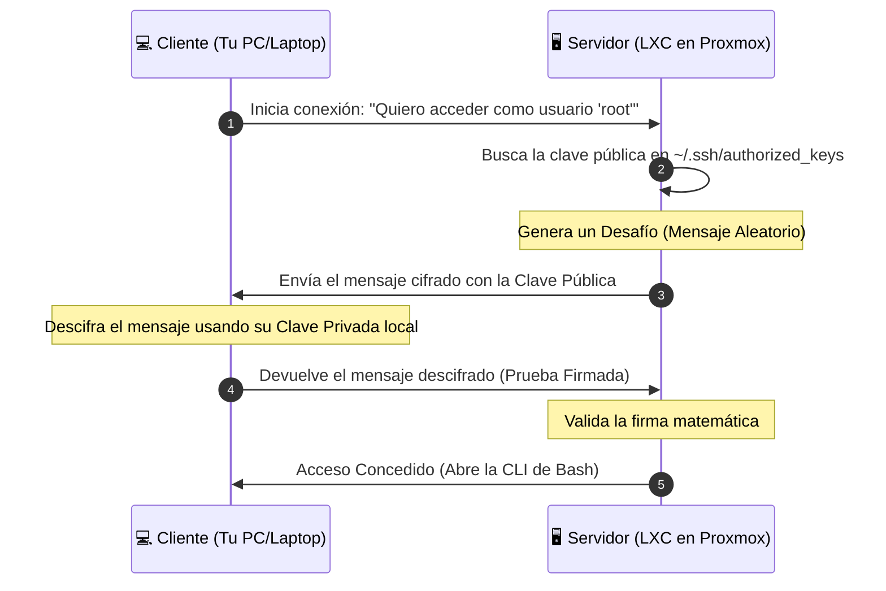

# Administración Remota mediante SSH (Secure Shell)

## 🎯 Relación con el Currículo (RA y CE)

* **Resultado de Aprendizaje 3 (RA3):** Administra de forma remota el sistema operativo en red valorando su importancia y aplicando criterios de seguridad.
    * **CE 3.a:** Se han analizado las ventajas e inconvenientes de la administración remota frente a la administración local.
    * **CE 3.b:** Se ha configurado el acceso remoto al servidor de forma segura.
    * **CE 3.c:** Se han utilizado herramientas de administración remota en modo texto y en modo gráfico.

---

## 🏢 El Protocolo SSH y la Administración Eficiente

En la administración de servidores Linux empresariales (como las instancias de Ubuntu Server corriendo en nuestro hipervisor Proxmox VE), el protocolo **SSH (Secure Shell)** es la herramienta estándar, segura y universal para interactuar con la interfaz de línea de comandos (CLI) a través de la red.

A diferencia de protocolos antiguos e inseguros como Telnet o Rsh, SSH cifra de extremo a extremo todo el tráfico de datos, incluyendo las credenciales de acceso, comandos introducidos y respuestas del sistema, operando por defecto en el puerto **TCP 22**.

---

## 🔑 Mecanismo de Autenticación mediante Claves Pública y Privada

Aunque el acceso tradicional mediante usuario y contraseña es funcional, los entornos de producción exigen el uso de **criptografía asimétrica** para la autenticación. Este método no solo aumenta radicalmente la seguridad frente a ataques de fuerza bruta, sino que permite la automatización total de tareas y scripts de monitorización desatendidos.

El mecanismo descansa sobre un par de claves criptográficas fuertemente vinculadas:


### 1. La Clave Privada (`id_rsa` / `id_ed25519`)
* **Propiedad:** Es el equivalente digital a tu llave física personal.
* **Custodia:** **Debe permanecer bajo el control absoluto y secreto del administrador** en su equipo cliente. Nunca, bajo ningún concepto, se transmite o se sube a la red.
* **Protección:** Se recomienda cifrarla localmente con una frase de paso (*passphrase*) para que, en caso de robo del dispositivo físico, no pueda ser utilizada de inmediato.

### 2. La Clave Pública (`id_rsa.pub` / `id_ed25519.pub`)
* **Propiedad:** Es el equivalente digital al candado de seguridad.
* **Custodia:** Es completamente segura y está diseñada para ser compartida. El administrador **la deposita e instala de forma permanente en todos los servidores remotos** a los que desea acceder de forma automatizada.

### 🔄 El Proceso Técnico de Validación (Handshake)
Cuando un cliente inicia una conexión SSH contra un servidor con llaves asimétricas, el sistema realiza la siguiente verificación transparente en segundo plano:

1. El cliente le indica al servidor con qué identidad (usuario) desea validar.
2. El servidor busca en el buzón de claves autorizadas del usuario si existe alguna clave pública vinculada.
3. El servidor genera un desafío (*challenge*): cifra un mensaje aleatorio utilizando esa clave pública y se lo envía de vuelta al cliente.
4. Dado que el mensaje **solo puede ser descifrado por la clave privada correspondiente**, el cliente utiliza su llave secreta local para resolver el acertijo matemático y devuelve la prueba firmada al servidor.
5. El servidor valida la firma y concede acceso inmediato al Shell sin necesidad de haber transmitido ninguna contraseña real por los cables de la red.


---

## 🛠️ Laboratorio Técnico: Despliegue de Llaves en Entornos de Aula

Para los despliegues prácticos del laboratorio, los alumnos deben automatizar sus accesos desde sus equipos hacia los contenedores LXC de Proxmox siguiendo esta secuencia estricta de comandos:

### Step 1: Generación del Par de Claves en el Cliente
Desde la terminal local del alumno (ya sea Windows PowerShell o una CLI de Linux), creamos el par de llaves asimétricas utilizando el algoritmo moderno y altamente seguro **Ed25519**:

```bash
# Generar el par de claves criptográficas asimétricas
ssh-keygen -t ed25519 -C "joseramon@iesmarcoszaragoza"
```

Durante el proceso, el asistente solicitará la ruta de guardado (por defecto en ~/.ssh/) y la frase de paso opcional.

Step 2: Instalación de la Clave Pública en el Servidor Remoto
Para inyectar el "candado" en el servidor Linux de destino, disponemos de dos metodologías de despliegue:

```bash
# Opción A: Automatizada (Disponible si el cliente es una máquina Linux)
ssh-copy-id -i ~/.ssh/id_ed25519.pub root@192.168.100.50

# Opción B: Manual (Inyección directa en el fichero de destino del servidor)
# 1. Mostramos el contenido de la clave pública en el cliente:
cat ~/.ssh/id_ed25519.pub

# 2. Copiamos el texto y lo pegamos dentro del archivo del servidor en la ruta:
# /home/usuario/.ssh/authorized_keys o /root/.ssh/authorized_keys
```

```bash
Step 3: Hardening y Aseguramiento del Demonio SSH (sshd_config)
Una vez que validamos que el acceso por llave funciona, es imperativo capar el acceso por contraseñas tradicionales para blindar el nodo. Editamos el archivo de configuración principal del servidor:

# Editar el archivo de directivas del servidor SSH
sudo nano /etc/ssh/sshd_config
```

Modificamos o añadimos las siguientes directivas de seguridad para aplicar el endurecimiento (hardening):

```bash
# Deshabilitar el acceso directo del superusuario root por contraseña tradicional
PermitRootLogin prohibit-password

# Forzar la exclusividad de autenticación mediante llaves asimétricas
PasswordAuthentication no

# Limitar los intentos de autenticación antes de rechazar la conexión por seguridad
MaxAuthTries 3
```

Para aplicar los cambios en caliente sin interrumpir los servicios activos, reiniciamos el demonio del sistema:

```bash
# Recargar la configuración del servicio mediante systemd
sudo systemctl restart sshd
```

## 🔍 Laboratorio de Desafíos y Troubleshooting (Entorno Proxmox)
### 💥 Caso Práctico: Rechazo de conexión SSH por violación de políticas de permisos POSIX (Permission Denied)
Síntoma: Tras inyectar de forma manual la clave pública dentro del archivo authorized_keys de un servidor virtualizado en Proxmox, el alumno intenta conectarse usando el comando ssh usuario@IP. El servidor rechaza la conexión de forma sistemática volviendo a pedir la contraseña tradicional o lanzando un error de denegación, a pesar de que la llave privada local es la correcta.

Causa Raíz: El demonio OpenSSH incorpora directivas de seguridad locales extremadamente rigurosas. Si el directorio oculto .ssh o el archivo físico authorized_keys disponen de permisos de lectura o escritura abiertos para el grupo o para el resto de usuarios del sistema (ej: permisos tipo 777), el servidor se negará a leer el archivo al considerar que la seguridad de la identidad ha sido comprometida por una mala configuración.

Solución Operativa en Clase: El alumno debe acceder al nodo (vía consola web de Proxmox) y aplicar de forma estricta la máscara de permisos POSIX recomendada por los estándares internacionales de seguridad:

```bash
# 1. Asignar propiedad exclusiva al usuario sobre su carpeta y configuración
chmod 700 ~/.ssh

# 2. Configurar permisos estrictos de lectura y escritura única para el propietario del candado
chmod 600 ~/.ssh/authorized_keys
```

## 📚 Referencias y Fuentes Consultadas
!!! info "Documentación Oficial y Autoría"
* Material Base: Desarrollado bajo los estándares formativos del Departamento de Informática del IES Marcos Zaragoza para el diseño de redes híbridas seguras.
* Cátedra / Autor: José Ramón Soria Nieto.
* Entorno de Aplicación: Contenidos prácticos del módulo de Administración de Sistemas Operativos (ASO), Segundo Curso del Ciclo Formativo de Grado Superior en Administración de Sistemas Informáticos en Red (ASIR/ASIX).

!!! abstract "Soporte Institucional y Fondos Europeos"
* Organismo de Control: Generalitat Valenciana — Conselleria d'Educació, Cultura i Esport.
* Financiación de Infraestructura: Proyecto cofinanciado por la Unión Europea a través del Fondo Social Europeo (FSE).
* «El FSE invierte en tu futuro» — Acciones destinadas a impulsar la excelencia didáctica, la modernización de laboratorios de virtualización avanzada de sistemas y la capacitación en ciberseguridad corporativa.