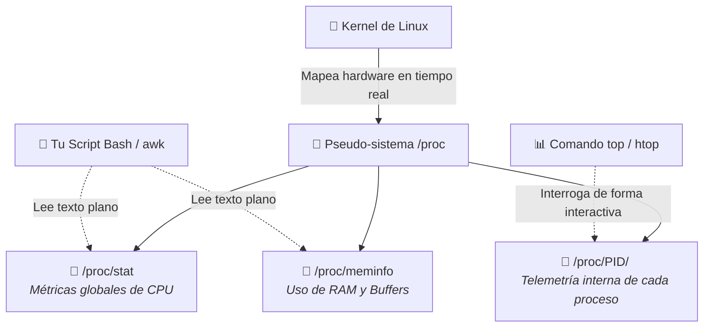

# Supervisión y Mantenimiento de Sistemas Linux

## 🎯 Relación con el Currículo (RA y CE)

* **Resultado de Aprendizaje 2 (RA2):** Gestiona la automatización de tareas del sistema, aplicando criterios de eficiencia y utilizando comandos y herramientas gráficas.
    * **CE 2.a:** Se han identificado los objetos del sistema que pueden ser supervisados.
    * **CE 2.b:** Se ha monitorizado el uso de los recursos del sistema en tiempo real.
    * **CE 2.c:** Se han generado gráficos y alertas de rendimiento.

---

## 🏢 La Filosofía del Sistema de Archivos `/proc` y `/sys`

A diferencia de Windows, que expone su telemetría mediante una API abstracta de contadores, Linux sigue la filosofía de diseño clásica de Unix: **"Todo es un archivo"**. El kernel de Linux expone el estado de salud del hardware, la memoria y las propiedades del planificador de procesos en tiempo real a través de pseudo-sistemas de archivos montados directamente en memoria RAM

* **/proc/stat:** Registra estadísticas acumuladas del sistema desde el arranque, desglosando los tiempos de CPU en contexto de usuario, sistema, nice e inactividad.
* **/proc/meminfo:** Expone de forma detallada el estado de la memoria RAM física, la memoria disponible, buffers y la memoria caché.
* **`/proc/[PID]`** Cada programa en ejecución (proceso) genera una carpeta temporal identificada con su Número de Identificador (*Process ID*), aislando sus hilos, sockets de red y consumo exacto de RAM.



---

## 📊 Comandos Esenciales de Monitorización en Tiempo Real

Para vigilar la infraestructura híbrida del laboratorio (contenedores LXC o MVs en Proxmox), el administrador interactúa con herramientas de terminal optimizadas que interrogan directamente al kernel:

### 1. Diagnóstico e Inspección de Procesos (`ps`)
El comando `ps` (*Process Status*) ofrece una captura estática de las tareas del sistema operativo. Al ejecutar el catálogo extendido `ps aux`, obtenemos un desglose analítico estructurado:

* **USER:** Usuario propietario que inicializó la ejecución.
* **PID:** Identificador único e independiente del proceso.
* **%CPU / %MEM:** Porcentaje de tiempo de procesador y uso de memoria real consumida.
* **VSZ / RSS:** Memoria virtual total asignada (*Virtual Size*) frente a la memoria física real retenida en la RAM (*Resident Set Size*) expresada en Kilobytes.
* **STAT:** Código de estado operacional. Destacan las identidades `S` (*Sleeping* o en espera de un evento), `R` (*Running* o ejecutable) y `Z` (*Zombie* o proceso terminado cuyo padre no ha leído su estado de salida).

### 2. Monitorización Global Interactiva (`top`)
El comando `top` proporciona una vista dinámica y en tiempo real de la actividad del sistema, dividiéndose en dos grandes áreas operativas:

#### Cabecera de Telemetría Global
Muestra la hora actual, el tiempo de actividad del nodo (*uptime*), usuarios conectados y la **carga media del sistema (*Load Average*)** calculada en intervalos de 1, 5 y 15 minutos. 

!!! info "Análisis de Contención de CPU"
    La línea de *Load Average* representa el número medio de procesos esperando CPU. En sistemas virtualizados con múltiples núcleos, un valor persistentemente superior al número de cores asignados en Proxmox señala saturación y degradación de rendimiento.

#### Desglose de Carga de la CPU
* **us (user):** Tiempo dedicado a los procesos lanzados en el espacio de usuario.
* **sy (system):** Tiempo consumido por el kernel del sistema operativo.
* **id (idle):** Tiempo de inactividad de los cores.
* **wa (iowait):** Tiempo muerto de CPU en espera de operaciones de Entrada/Salida a disco o red. Valores altos delatan cuellos de botella severos en los discos NVMe físicos del servidor.

#### Atajos de Teclado del Monitor Interactivo:
* `q`: Finaliza e interrumpe de forma segura la ejecución de `top`.
* `P`: Ordena de forma automática la lista de procesos según su uso de CPU.
* `M`: Ordena la tabla analítica según el consumo de memoria RAM.
* `k`: Lanza de forma interactiva el envío de señales de terminación a un PID (`SIGTERM 15` para cierre limpio o `SIGKILL 9` para terminación forzada de procesos colgados).

### 3. Estado de la Memoria RAM y Swap (`free`)
Permite inspeccionar de un vistazo la memoria física libre, utilizada y disponible:

```bash
# Mostrar la memoria RAM disponible formateada en megabytes o gigabytes legibles
free -h
```

* buff/cache: Memoria física temporal reutilizable que el kernel usa para optimizar lecturas y agrupar escrituras a disco, reduciendo los accesos directos al almacenamiento.

4. Ocupación de Almacenamiento y Árbol de Bloques (df / du / lsblk)df -h: Muestra el espacio total, usado y disponible de todos los sistemas de archivos lógicos montados en formato legible.  du -sh /var/log/: Calcula de forma recursiva y resumida el tamaño exacto de un directorio específico.  lsblk: Renderiza en forma de árbol los dispositivos de bloque físicos (discos, particiones) y sus correspondientes puntos de montaje.

🛠️ Automatización de la Captura de Telemetría con Bash
Para emular el comportamiento de producción del proyecto integrador, los alumnos deben automatizar la recolección de métricas leyendo directamente los descriptores del sistema sin la sobrecarga computacional de herramientas interactivas:

```bash
#!/bin/bash
# /root/scripts/auditar_linux.sh
# Extracción automatizada de métricas base del servidor híbrido

clear
echo "========================================================"
echo "      TELEMETRÍA OPERACIONAL DE SERVIDORES LINUX       "
echo "========================================================"

# 1. Leer de forma secuencial las métricas acumuladas de CPU en /proc/stat
read -r cpu user nice system idle iowait irq softirq steal < /proc/stat

# 2. Filtrar y extraer la memoria RAM disponible en Megabytes desde /proc/meminfo
RAM_LIBRE=$(grep "MemAvailable" /proc/meminfo | awk '{print $2 / 1024}')
echo "  ► Memoria RAM Disponible:    ${RAM_LIBRE} MB"

# 3. Extraer el porcentaje de ocupación del disco raíz (/) usando df
USO_DISCO=$(df / | tail -1 | awk '{print $5}' | sed 's/%//')
echo "  ► Ocupación de Disco Raíz:   ${USO_DISCO} %"

# 4. Extraer el Load Average del último minuto desde /proc/loadavg
LOAD_1MIN=$(cat /proc/loadavg | awk '{print $1}')
echo "  ► Carga Promedio (1 min):    ${LOAD_1MIN}"
echo "========================================================"
```

🔍 Laboratorio de Desafíos y Troubleshooting (Entorno Proxmox)💥 Caso Práctico: Caída del Servidor de Archivos Samba por saturación de inodos en el disco virtualSíntoma: El contenedor LXC de Ubuntu que actúa como File Server compartido con Samba deja repentinamente de aceptar la creación de nuevos archivos o scripts por parte de los alumnos. Al ejecutar df -h, el comando muestra de forma engañosa que el volumen de almacenamiento dispone de más de un 40% de espacio de almacenamiento físico libre.  Causa Raíz: Agotamiento de la tabla de metadatos del sistema de archivos EXT4. En Linux, cada archivo o directorio requiere un identificador único llamado Inodo. Si una tarea programada o un bucle erróneo genera millones de micro-archivos de logs temporales, la tabla de inodos se satura al 100%, bloqueando la creación de cualquier nuevo objeto en el disco a pesar de quedar gigabytes físicos libres en los sectores del disco.Solución Operativa en Clase: El alumno debe auditar la tabla de inodos mediante la CLI del servidor utilizando el parámetro descriptor -i y purgar de forma imperativa los archivos basura acumulados:

```bash
# 1. Inspeccionar la ocupación porcentual de la tabla de inodos de los discos montados
df -i

# 2. Localizar de forma recursiva qué directorio acumula el mayor número de archivos
find /var/log -type f | wc -l

# 3. Vaciar los ficheros o logs huérfanos para liberar inodos de inmediato
rm -rf /var/log/temporales_basura/*
```

📚 Referencias y Fuentes Consultadas!!! info "Documentación Oficial y Autoría"
* Material Base: Basado en la unidad didáctica e imágenes de consolas operativas "UD4. Fundamentos de administración de Linux - Supervisión y mantenimiento" del Departamento de Informática del IES Marcos Zaragoza.
* Diseño y Autoría: José Ramón Soria Nieto.
* Entorno de Aplicación: Módulo profesional de Administración de Sistemas Operativos (ASO), correspondiente al Segundo Curso del Ciclo Formativo de Grado Superior en Administración de Sistemas Informáticos en Red (ASIR/ASIX).  !!! abstract "Soporte Institucional y Fondos Europeos"
* Entidad Reguladora: Generalitat Valenciana — Conselleria d'Educació, Cultura i Esport.
* Financiación de Infraestructura: Proyecto cofinanciado por la Unión Europea a través del Fondo Social Europeo (FSE).
* «El FSE invierte en tu futuro» — Acciones destinadas a la modernización de entornos tecnológicos de Formación Profesional e inserción laboral avanzada en administración de sistemas.
