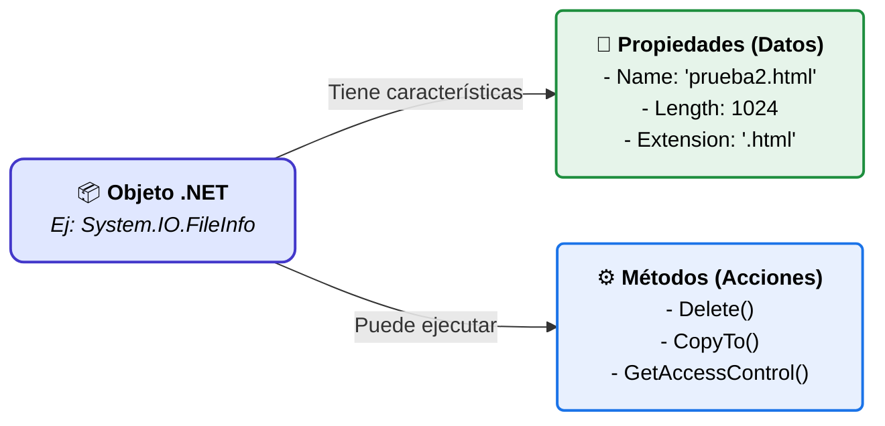

# Fundamentos de PowerShell y Comandos Básicos

## ¿Qué es el Shell de un Sistema Operativo?

El **Shell** es la interfaz que permite que un usuario (ya sea administrador o desarrollador) interactúe con el Sistema Operativo. Se encuentra en el último paso de la secuencia de arranque de un equipo:

1. BIOS / UEFI
2. Cargador del sistema operativo
3. Arranque del sistema operativo (componentes, controladores, etc.)
4. **Shell** (preparado para que el usuario interaccione con el equipo)

A través del shell, podemos:

- Actuar sobre el sistema, configurándolo y obteniendo información.
- Automatizar tareas repetitivas.

El shell puede presentarse en dos modos:

- **Modo gráfico**: Windows Desktop, escritorios de Linux (Gnome, KDE, etc.), MacOS Desktop, y las interfaces gráficas en dispositivos móviles (Android, iOS).
- **Modo texto (consola o terminal)**:
    - En Windows: `cmd` y **PowerShell**.
    - En Linux y MacOS: `Bash`, `csh`, `zsh`, `tcsh`, `ksh`, etc.

---

## Introducción a PowerShell

**PowerShell** es una solución de automatización de tareas multiplataforma formada por una interfaz de línea de comandos (CLI), un lenguaje de scripting y un marco de administración de configuración.

Características principales:

- Sustituye a `cmd.exe`.
- Compite con los shells de entornos Linux y Mac.
- Está orientado a objetos (trabaja con objetos de .NET en lugar de simplemente texto).
- Ofrece una experiencia muy potente tanto como interfaz de línea de comandos como lenguaje de scripts avanzado y completo.
- Permite una interacción avanzada desde consola.

### ¿Sobre qué sistemas y servicios podemos utilizar PowerShell?

- **Sistemas Operativos**: Windows 11, Windows Server, MacOS, Linux.
- **Sistemas de virtualización y Cloud**: Azure, AWS, VMWare vSphere.
- **Servicios**: SQL Server, Internet Information Services (IIS), SharePoint, Office 365, etc.

### Versiones de PowerShell

Existen principalmente dos ramas:

1. **Windows PowerShell (`powershell.exe`)**
    - Basada en .NET estándar.
    - Diseñada exclusivamente para Windows y viene integrada en el sistema operativo.
    - Su última versión es la 5.1. Microsoft no continuará desarrollándola con nuevas versiones, ya que el enfoque principal ha pasado a PowerShell Core.

    

2. **PowerShell Core (`pwsh.exe`)**
    - Basada en .NET Core (lo que la hace **multiplataforma**). Funciona en Windows, Linux y MacOS.
    - Su desarrollo es de código abierto (OpenSource) y se encuentra en GitHub con el apoyo de la comunidad.
    - Contiene un subconjunto de los comandos de Windows PowerShell, pero en continuo desarrollo y ampliación.
    - Se debe instalar manualmente (las versiones modernas de PowerShell parten de la 6.0 en adelante).
    - Puede coexistir en el mismo sistema junto a Windows PowerShell (`powershell.exe`).

    

---

## Sintaxis de los Comandos: Cmdlets

En PowerShell existen varios tipos de comandos. Las principales diferencias son:

- **Cmdlets (command-lets):** Son los comandos nativos compilados de PowerShell (escritos normalmente en C# u otro lenguaje .NET). Están altamente integrados y optimizados.
- **Funciones:** Son bloques de código escritos en el propio lenguaje de PowerShell. Pueden actuar igual que un cmdlet pero son scripts interpretados en lugar de código compilado.
- **Alias:** Son nombres alternativos o atajos cortos que apuntan a cmdlets o funciones existentes (por ejemplo, `dir` o `ls` son alias que apuntan al cmdlet `Get-ChildItem`).

La nomenclatura de los cmdlets y funciones sigue una regla estricta:

**`Verbo-Nombre` (`-Parámetro` Valor)**

- **Verbo**: Indica la acción a realizar. Ejemplos: `Get` (obtener), `Set` (establecer), `Remove` (eliminar), `New` (nuevo).
- **Nombre**: Indica el elemento sobre el que se actúa. Ejemplos: `LocalUser`, `LocalGroup`, `NetAdapter`, `Partition`, `Service`.
- **Parámetros**: Proporcionan los datos o filtros que el cmdlet necesita para particularizar la acción. Muchos son opcionales.

**Importante**: PowerShell **no distingue entre mayúsculas y minúsculas** (Not case-sensitive).

Ejemplos:
```powershell
Get-Service
Get-Service -ComputerName localhost
Get-LocalUser
Remove-LocalUser
New-LocalGroup -Name GrupoPrueba
Get-NetAdapter
```

### Caracteres especiales y Tuberías (Pipe)

- **`|` (Pipe o tubería)**: Sirve para unir dos comandos. La salida del comando de la izquierda se pasa como entrada al comando de la derecha.
- **`*` (Comodín / Asterisco)**: Representa cualquier conjunto de caracteres. Muy útil para buscar patrones.

```powershell
Get-Service | more
Get-Service | Format-Table -AutoSize
Get-Service -DisplayName *Redes*
Get-Service -Name *Net*
```

---

## Descubriendo el entorno: Comandos de Ayuda

PowerShell es "autodescubrible". No necesitas memorizar todos los comandos gracias a tres cmdlets fundamentales:

### 1. `Get-Command`
Muestra todos los cmdlets, funciones y alias disponibles en la sesión de PowerShell.
```powershell
Get-Command
Get-Command Add* | more
Get-Command -Name *IP* -Module NetTCPIP
Get-Command -Type Function | Measure-Object
Get-Command -Verb New | more
```

### 2. `Get-Help`
Muestra la ayuda detallada de los cmdlets, funciones y alias.
```powershell
Get-Help Get-Date
Get-Help New-LocalUser
```

Puedes ampliar la información usando modificadores como `-Examples` o `-Full`:
```powershell
help Get-Service -Examples
help Get-Service -Full
```
*(Nota: `help` es un alias o función predefinida para `Get-Help | more`)*

Para mantener la ayuda actualizada (requiere ejecutar PowerShell como Administrador):
```powershell
Update-Help
```
También existen archivos conceptuales llamados `about_` que explican el funcionamiento interno de PowerShell:
```powershell
help *about*
help about_Aliases
```

### 3. `Get-Member`
Muestra las propiedades y métodos de los objetos devueltos por un comando. (Ver siguiente sección).

---

## Trabajando con Objetos

A diferencia de Bash o CMD, que devuelven salidas en texto plano que a menudo requieren ser parseadas (con `grep`, `awk`, etc.), **PowerShell trata los datos como Objetos**.

No es necesario procesar o recortar la salida de texto para extraer la información. 

### ¿Qué es un objeto?
Es un conjunto de información que identifica/describe a un elemento mediante:

- **Propiedades**: Sus características (por ejemplo, el nombre de un archivo, su tamaño, su fecha de creación).
- **Métodos**: Acciones o la forma de modificar dichas características (por ejemplo, eliminar el archivo, moverlo).

!!! info "Rigor técnico: Integración con .NET"
    De forma estricta, PowerShell está construido sobre el ecosistema **.NET**. Por tanto, **los objetos en PowerShell son instancias directas de clases de .NET** (por ejemplo, `System.IO.FileInfo` para un archivo o `System.ServiceProcess.ServiceController` para un servicio). 
    
    PowerShell no inventa sus propios tipos de datos aislados; actúa como una interfaz de scripting o *shell* que instancia, expone y permite acceder de forma nativa a las propiedades y métodos definidos en la arquitectura subyacente de las clases de .NET.

Aquí tienes una explicación con ejemplos prácticos de por qué trabajar con objetos en PowerShell es mucho más potente que trabajar con texto:

### El Problema: Procesar texto (La forma antigua)
Imagina que en CMD o Bash quieres listar los servicios que están detenidos y mostrar solo su nombre y descripción.

**En CMD:**
```batch
sc query | find /i "STATE : 1 STATE"
```
**Salida (Texto):**
```
 STATE              : 1  (STOPPED)
 DISPLAY_NAME     : BluetoothUserService

 STATE              : 1  (STOPPED)
 DISPLAY_NAME     : Windows Backup
```
**Problema:** Tienes que usar comandos externos (`find`) para filtrar texto. Si el mensaje "STOPPED" cambia o está en otro idioma, el script falla. Además, tienes que "recortar" la línea para separar la etiqueta del valor.

### La Solución: Trabajar con Objetos (La forma PowerShell)
En PowerShell, el comando `Get-Service` devuelve **Objetos** con propiedades estructuradas (como `Status`, `DisplayName`, etc.).

```powershell
Get-Service | Where-Object {$_.Status -eq "Stopped"} | Select-Object DisplayName, Status
```
**Salida:**
```
DisplayName                 Status
-----------                 ------
BluetoothUserService        Stopped
Windows Backup              Stopped
```
**¿Qué ha pasado?**

1.  **`Get-Service`**: No genera texto, crea objetos de tipo "Servicio".
2.  **`Where-Object`**: Filtra estos objetos. Compara la **Propiedad** `Status` del objeto.
3.  **`Select-Object`**: Selecciona qué **Propiedades** mostrar en la tabla.

**La Ventaja:** Si luego quieres guardar esa información en un archivo CSV, en PowerShell es trivial:
```powershell
Get-Service | Where-Object {$_.Status -eq "Stopped"} | Select-Object DisplayName, Status | Export-Csv -Path C:\temp\servicios_detenidos.csv -NoTypeInformation
```
En CMD, tendrías que usar `> archivo.txt` y luego un script complejo para darle formato CSV.

---

!!! tip "Analogía: El Objeto Coche"
    Imagina que un objeto es un **Coche**.
    Sus **propiedades** son el color, la matrícula o el número de puertas (datos).
    Sus **métodos** son arrancar, frenar o encender_luces (acciones).

Un comando como `Get-ChildItem` (que lista el contenido de un directorio) no devuelve simple texto; devuelve **objetos de tipo archivo o carpeta**. Cada uno de ellos tiene sus propias propiedades y métodos.



### Uso de `Get-Member`
Para saber qué propiedades o métodos tiene un objeto devuelto por un comando, lo pasamos por una tubería a `Get-Member`:
```powershell
Get-ChildItem .\prueba2.html | Get-Member
```
Al ejecutarlo, lo primero que aparece en la parte superior de la salida es el **`TypeName`** (por ejemplo, `System.IO.FileInfo`). Esto nos indica exactamente qué tipo de objeto subyacente de .NET estamos manejando.

**Ejemplo de salida (recortada):**
```text
   TypeName: System.IO.FileInfo

Name                      MemberType     Definition
----                      ----------     ----------
CopyTo                    Method         System.IO.FileInfo CopyTo(string destFileName)...
Delete                    Method         void Delete()
MoveTo                    Method         void MoveTo(string destFileName)...
CreationTime              Property       datetime CreationTime {get;set;}
Extension                 Property       string Extension {get;}
FullName                  Property       string FullName {get;}
IsReadOnly                Property       bool IsReadOnly {get;set;}
Length                    Property       long Length {get;}
Name                      Property       string Name {get;}
```
Como puedes observar, la tabla muestra claramente el tipo de cada miembro (`MemberType` = Method o Property), así como los datos que devuelve o los parámetros que acepta (`Definition`).

### Acceso a propiedades y métodos

Podemos acceder directamente a una propiedad o método de un comando envolviéndolo entre paréntesis y usando el signo `$`:
```powershell
# Acceder a propiedades
$(comando).NombrePropiedad
$(Get-ChildItem .\prueba2.html).Length

# Ejecutar métodos
$(comando).NombreMétodo()
$(Get-ChildItem .\prueba2.html).GetAccessControl()

# Ejemplo con Get-Date
$(Get-Date).Month
$(Get-Date).AddDays(3)
```

**Uso con Variables (Recomendado para Scripts)**
Lo más habitual, especialmente al crear scripts, es guardar ese objeto en una variable para trabajar con él de forma más limpia:
```powershell
$archivo = Get-ChildItem .\prueba2.html

# Consultar propiedades del objeto guardado
$archivo.Length
$archivo.CreationTime

# Ejecutar métodos sobre el objeto guardado
$archivo.Delete()
```

## 📝 Ejercicios Prácticos

A continuación se plantean una serie de ejercicios para afianzar los conceptos de comandos, ayuda y manejo de objetos en PowerShell.

### Descubrimiento de comandos (`Get-Command`)

1. **Muestra los comandos que comienzan por el verbo obtener.**
??? success "Ver solución"
    ```powershell
    Get-Command -Verb Get
    ```

2. **Muestra los comandos de los módulos Microsoft.PowerShell.Security y Microsoft.PowerShell.Utility.**
??? success "Ver solución"
    ```powershell
    Get-Command -Module Microsoft.PowerShell.Security, Microsoft.PowerShell.Utility
    ```

3. **Muestra los comandos que contienen la palabra *drive*.**
??? success "Ver solución"
    ```powershell
    Get-Command *drive*
    ```

4. **Muestra los comandos que contienen el verbo Set y pertenecen al módulo DISM.**
??? success "Ver solución"
    ```powershell
    Get-Command -Verb Set -Module DISM
    ```

5. **Busca en la web https://docs.microsoft.com/es-es/powershell/ los comandos que forman parte del módulo NetSecurity. ¿Cuál de ellos sirve para ver las reglas del firewall? Pruébalo.**
??? success "Ver solución"
    Vamos al explorador de módulos y buscamos NetSecurity. Observamos que `Get-NetFirewallRule` es el comando que sirve para ver las reglas del firewall.
    ```powershell
    Get-NetFirewallRule
    ```

### Sistema de Ayuda y Módulos (`Get-Help` y `Get-Module`)

1. **Muestra la ayuda de `Get-Command` y lee su descripción.**
??? success "Ver solución"
    ```powershell
    Get-Help Get-Command
    ```

2. **Actualiza la ayuda de PowerShell Core.**
??? success "Ver solución"
    ```powershell
    # Lanza pwsh.exe si es necesario
    Update-Help
    ```

3. **Busca en la ayuda del comando `Get-Module` la opción para ver todos los módulos instalados en el equipo. Lanza dicho comando con dicha opción.**
??? success "Ver solución"
    ```powershell
    Get-Help Get-Module -Full
    Get-Module -ListAvailable
    ```

4. **Busca los cmdlets disponibles en el módulo Storage. ¿Y de tipo function?**
??? success "Ver solución"
    ```powershell
    Get-Command -Module Storage -Type cmdlet
    Get-Command -Module Storage -Type function
    ```

5. **Prueba algún ejemplo de uso de alguno de los cmdlets con verbo Get de dicho módulo.**
??? success "Ver solución"
    ```powershell
    Get-Command -Module Storage -Verb Get
    # Por ejemplo, Get-Disk muestra los discos que tiene el equipo.
    Get-Disk
    ```

6. **Lee la ayuda `about_Core_commands`. ¿Para qué son los cmdlets que aparecen? Prueba alguno. ¿Qué entiendes por PowerShell Provider?**
??? success "Ver solución"
    ```powershell
    Get-Help about_Core_commands
    Get-ChildItem C:\Users\joseramon
    ```
    Un *provider* es una capa de .NET que proporciona acceso a datos de cualquier fuente, por ejemplo, un disco. Con `Get-PSProvider` observamos los proveedores a los que tenemos acceso.

### Descubrimiento de objetos (`Get-Member`) y Propiedades

1. **Muestra la ayuda del comando `Get-Member`. ¿Qué comando lanzarías para ver únicamente las propiedades, Property y AliasProperty, de los objetos devueltos por el comando `Get-Service`?**
??? success "Ver solución"
    ```powershell
    Get-Help Get-Member
    Get-Service | Get-Member -Type Property,AliasProperty
    ```

2. **Muestra la propiedad Name de los objetos devueltos por `Get-Service`.**
??? success "Ver solución"
    ```powershell
    $(Get-Service).Name
    ```

3. **Muestra las propiedades y métodos del comando `Get-PSDrive -PSProvider FileSystem`. A continuación, muestra: la propiedad nombre del dispositivo y la propiedad espacio libre.**
??? success "Ver solución"
    ```powershell
    Get-PSDrive -PSProvider FileSystem | Get-Member
    $(Get-PSDrive -PSProvider FileSystem).Name
    $(Get-PSDrive -PSProvider FileSystem).Free
    ```

4. **Muestra las propiedades y métodos de los objetos devueltos por el comando `Get-NetIPAddress`. A continuación, muestra únicamente la propiedad de ip versión 4. También lanza el método `GetHashCode()`.**
??? success "Ver solución"
    ```powershell
    Get-NetIPAddress | Get-Member
    $(Get-NetIPAddress).IPv4Address
    $(Get-NetIPAddress).GetHashCode()
    ```

5. **Mediante las propiedades y métodos adecuados del cmdlet `Get-Date`, muestra únicamente la hora del sistema y el tipo de dato.**
??? success "Ver solución"
    ```powershell
    $(Get-Date).Hour
    $(Get-Date).GetType()
    ```

---

## 📚 Referencias y Fuentes Consultadas

!!! info "Documentación Oficial y Autoría"
    * **Material Base:** Presentación de clase *«Administración de Sistemas. El Shell de los sistemas operativos. Comandos básicos en PowerShell»* (PDF adjunto).
    * **Autoría del Temario:** José Ramón Soria Nieto.
    * **Marco Curricular:** Programación didáctica para el módulo de *Administración de Sistemas Operativos (ASO)* del Ciclo Formativo de Grado Superior en *Administración de Sistemas Informáticos en Red (ASIR/ASIX)*.
    * **Documentación Oficial:** [Documentación oficial de PowerShell (Microsoft Learn)](https://learn.microsoft.com/es-es/powershell/)
    * **Material adicional:** [Ejemplos de scripts para la administración (Microsoft Learn)](https://learn.microsoft.com/es-es/powershell/scripting/samples/sample-scripts-for-administration?view=powershell-7.6)
    * **Módulos de PowerShell:** [Módulos para Windows Server 2025 (Microsoft Learn)](https://learn.microsoft.com/es-es/powershell/module/?view=windowsserver2025-ps)

!!! abstract "Cofinanciación y Soporte Institucional"
    * **Entidad Educativa:** Generalitat Valenciana — Conselleria d'Educació, Cultura i Esport.
    * **Fondo de Financiación:** Proyecto cofinanciado por la **Unión Europea** a través del **Fondo Social Europeo (FSE)**. 
    * *«El FSE invierte en tu futuro»* — Acciones orientadas al impulso de la educación, formación avanzada y preparación para el mercado laboral técnico.
