```mermaid
graph LR
    O1["📦 <b>Origen</b>"]
    
    Cmd1["⚙️ <b>Cmdlet 1 (Generador)</b><br>Ej. <i>Get-Service</i>"]
    Int1["📦📦📦<br><i>Muchos objetos íntegros</i>"]
    
    Cmd2["🔍 <b>Cmdlet 2 (Filtro)</b><br>Ej. <i>Where-Object</i>"]
    Int2["📦<br><i>Menos objetos íntegros</i>"]
    
    Cmd3["📋 <b>Cmdlet 3 (Recorte)</b><br>Ej. <i>Select-Object</i>"]
    
    O2["📝 <b>Resultado</b><br><i>Objetos filtrados<br>y con menos propiedades</i>"]

    O1 --> Cmd1
    Cmd1 -->|Tubería| Int1
    Int1 --> Cmd2
    Cmd2 -->|Tubería| Int2
    Int2 --> Cmd3
    Cmd3 -->|Tubería| O2

    style O1 fill:#f3f4f6,stroke:#9ca3af,stroke-width:2px,color:#000
    style Int1 fill:#f0fdf4,stroke:#16a34a,stroke-width:2px,color:#000,stroke-dasharray: 5 5
    style Int2 fill:#f0fdf4,stroke:#16a34a,stroke-width:2px,color:#000,stroke-dasharray: 5 5
    style O2 fill:#dbeafe,stroke:#3b82f6,stroke-width:2px,color:#000
    style Cmd1 fill:#e0e7ff,stroke:#4338ca,stroke-width:2px,color:#000,rx:10,ry:10
    style Cmd2 fill:#e0e7ff,stroke:#4338ca,stroke-width:2px,color:#000,rx:10,ry:10
    style Cmd3 fill:#e0e7ff,stroke:#4338ca,stroke-width:2px,color:#000,rx:10,ry:10
```

# Uso del Pipeline y Manipulación de Datos

## Uso del Pipeline (`|`)

Al igual que en Linux, el uso del símbolo `|` (tubería o *pipe*, equivalente a la canalización de comandos) es muy frecuente entre los administradores de sistemas a la hora de enlazar la salida de un comando como entrada de otro.

```powershell
COMANDO 1 | COMANDO 2
```

En PowerShell, a diferencia de otros sistemas que envían flujos de texto, **el *pipe* transfiere objetos completos**. Los objetos de salida del "Comando 1" se convierten automáticamente en los objetos de entrada para el "Comando 2".

Se pueden encadenar tuberías para obtener un filtrado cada vez más selectivo.

```powershell
COMANDO 1 | COMANDO 2 | ... | COMANDO N
```
*Los objetos de salida del comando N-1 son la entrada para el comando N.*

Por ejemplo, el siguiente comando se representa gráficamente en el diagrama inferior:

```powershell
Get-Service | Where-Object Status -eq 'Running' | Select-Object Name, DisplayName
```



---

## Cmdlets principales para el procesamiento de objetos

A través de la tubería, solemos utilizar un conjunto de cmdlets fundamentales para filtrar, ordenar y agrupar la información. 

Los más utilizados son:

- `Select-Object`
- `Sort-Object`
- `Group-Object`
- `Where-Object`
- `Measure-Object`
- `ForEach-Object`

!!! info "Entorno de prácticas: Módulo PSTeachingTools"
    Para ilustrar el funcionamiento del pipeline de forma sencilla y didáctica, en los siguientes ejemplos utilizaremos datos ficticios sobre hortalizas (mediante comandos como `Get-Vegetable`) en lugar de comandos reales y complejos del sistema.
    
    Estos comandos de prueba pertenecen al módulo **`PSTeachingTools`**, alojado en el repositorio oficial de la comunidad (*PowerShell Gallery*).

    **1. Buscar el módulo**
    Antes de instalar nada, es una buena práctica comprobar que el módulo existe y está disponible en la galería:
    ```powershell
    Find-Module -Name PSTeachingTools
    ```
    
    **2. Instalar el módulo**
    Una vez comprobado, podemos descargarlo e instalarlo en nuestro equipo:
    ```powershell
    Install-Module -Name PSTeachingTools -Scope CurrentUser
    ```

    *(Nota: Si PowerShell te advierte de que PSGallery es un repositorio no de confianza, simplemente responde Sí `[Y]` o Sí a todo `[A]`).*

    - **`Install-Module`**: Se conecta a la PowerShell Gallery, descarga los archivos del módulo y los registra en tu equipo.
    - **`-Scope CurrentUser`**: Es un parámetro de seguridad crucial. Le indica a PowerShell que instale el módulo únicamente en la carpeta personal de tu usuario actual. Esto permite realizar la instalación **sin necesidad de permisos de Administrador** y evita alterar la configuración general del resto del sistema.
    
    **3. Comprobar los comandos que incluye el módulo**
    Antes de usar un módulo, es importante saber qué comandos nos ofrece. 
    ```powershell
    Get-Command -Module PSTeachingTools
    ```

### 1. `Select-Object` (alias: `select`)

Permite seleccionar solo las propiedades que nos interesan de un objeto o un subconjunto de los objetos (por ejemplo, los primeros 'x' objetos).

Antes de usar `Select-Object`, es fundamental saber cómo se llaman exactamente las propiedades. Para ello, siempre nos apoyaremos en `Get-Member`. 

Imagina que queremos seleccionar el estado de la hortaliza y probamos con la palabra `State` pero no funciona. Si examinamos el objeto, descubriremos su nombre real:

```powershell
# 1. Exploramos el objeto para ver sus propiedades reales
Get-Vegetable | Get-Member

# (Descubrimos que la propiedad del estado se llama "CookedState", no "State")

# 2. Ahora sí, seleccionamos las propiedades correctas
Get-Vegetable | Select-Object -Property Name, Count, CookedState

# Selecciona únicamente el primer objeto de la lista
Get-Vegetable | Select-Object -First 1

# Selecciona valores únicos (sin duplicados)
Get-Vegetable | Select-Object State -Unique
```

!!! tip "Select-Object vs Format-Table / Format-List"
    Es común confundir `Select-Object` con los comandos de formato (`Format-Table`, `Format-List`). 
    
    - **`Select-Object`** **modifica** la estructura real del objeto de datos (crea uno nuevo con menos propiedades) para seguir usándolo en la tubería o guardarlo en una variable.
    - **`Format-*`** destruye el objeto original y lo convierte en **simple texto** (directivas de formato visual) pensado exclusivamente para pintar tablas o listas por pantalla. **Regla general:** Nunca pongas un comando después de un `Format-*` en la tubería. Al haber perdido su estructura de objeto y haberse convertido en texto plano, los comandos posteriores serán incapaces de interpretar, entender o filtrar esos datos.

!!! tip "Visualización interactiva con Out-GridView (ogv)"
    Si trabajas en un entorno de escritorio Windows, puedes añadir `| Out-GridView` al final de tu pipeline para enviar los objetos a una ventana interactiva. Esta ventana te permite ordenar alfabéticamente haciendo clic en las columnas y aplicar filtros dinámicos en vivo sin tener que modificar tu código.

### 2. `Sort-Object` (alias: `sort`)

Permite ordenar los objetos basándose en los valores de una o varias de sus propiedades.

```powershell
# Ordena por defecto en orden ascendente
Get-Vegetable | Sort-Object -Property Count

# Ordena en orden descendente usando el parámetro -Descending
Get-Vegetable | Sort-Object Count -Descending

# Ordena por una propiedad, conservando solo ciertas propiedades visibles
Get-Vegetable | Sort-Object Count -Descending | Select-Object Count, Name
```

### 3. `Group-Object` (alias: `group`)

Agrupa los objetos que contienen el mismo valor para las propiedades especificadas. Retorna nuevos objetos de agrupación (`GroupInfo`) que contienen tres propiedades principales: `Count` (cantidad), `Name` (el valor agrupado) y `Group` (una lista que encierra los objetos originales).

```powershell
# Agrupa los objetos por su color
Get-Vegetable | Group-Object -Property Color

# Agrupa y cuenta de forma ordenada
Get-Vegetable | Group-Object Color | Sort-Object Count -Descending
```

Si solo nos interesa el resumen estadístico (las columnas `Count` y `Name`) y queremos **obviar** la columna `Group` que contiene todos los objetos (muy útil para mejorar el rendimiento si hay miles de datos), usamos el parámetro `-NoElement`:
```powershell
Get-Vegetable | Group-Object Color -NoElement
```

Por el contrario, si nuestro objetivo es "desglosar" o extraer los elementos concretos que han quedado guardados dentro de una agrupación, usaremos `Select-Object`:
```powershell
Get-Vegetable | Group-Object Color | Select-Object -ExpandProperty Group
```

### 4. `Where-Object` (alias: `where` o `?`)

Permite filtrar objetos de una colección según el valor de sus propiedades.

!!! warning "IMPORTANTE: Regla de Oro en PowerShell (Filter Left, Format Right)"
    **¡NO uses `Where-Object` si el cmdlet origen tiene un parámetro para filtrar directamente!**
    Es mucho más eficiente que el comando origen ya traiga la información filtrada (usando sus propios parámetros, por ejemplo `-Filter` o `-Name`) antes que enviar miles de objetos por la tubería para que `Where-Object` los descarte después.
    
    Observa la diferencia de rendimiento (especialmente notable en búsquedas grandes):
    ```powershell
    # ❌ MAL: Lento y costoso (trae absolutamente todos los archivos y luego descarta)
    Get-ChildItem -Path C:\Windows | Where-Object Extension -eq '.txt'
    
    # ✅ BIEN: Rápido y eficiente (el sistema de archivos filtra directamente)
    Get-ChildItem -Path C:\Windows -Filter *.txt
    ```

**Formas de lanzar `Where-Object`**:

Existen sintaxis simplificadas y sintaxis de bloque de script (scriptblock).
```powershell
# Sintaxis básica especificando el nombre de la propiedad
Get-Vegetable | Where-Object -Property Color -eq 'yellow'

# Sintaxis simplificada
Get-Vegetable | Where Color -eq 'yellow'

# Sintaxis de ScriptBlock (usando $_ que representa "el objeto actual en el pipe")
Get-Vegetable | Where-Object { $_.Color -eq 'yellow' }
```

!!! info "Comprendiendo la variable `$_` (o `$PSItem`)"
    Al trabajar con bloques de script en la tubería (`{ ... }`), necesitas una forma de referirte al objeto que está pasando por ese "tramo" del tubo en cada iteración.
    
    Ahí entra **`$_`** (también puedes usar **`$PSItem`**; son exactamente lo mismo). Imagina que es un comodín que significa *"el objeto actual que estoy procesando"*. Así, `$_.Color` significa *"lee la propiedad Color del objeto actual"*.

Se pueden aplicar comparadores múltiples:
```powershell
Get-Vegetable | Where-Object { $_.Count -gt 10 -and $_.Color -eq 'green' } | Sort-Object Count -Descending
```

#### Comparadores en PowerShell

PowerShell utiliza operadores especiales para las comparaciones. Por defecto, **no distinguen entre mayúsculas y minúsculas** (case-insensitive). Si necesitas distinción, añade una `c` delante (ej. `-ceq`).

| Operador | Descripción (Comparación) |
| :--- | :--- |
| `-eq` | Igual a (equals) |
| `-ne` | No igual a (not equals) |
| `-gt` | Mayor que (greater than) |
| `-ge` | Mayor o igual que (greater than or equal) |
| `-lt` | Menor que (less than) |
| `-le` | Menor o igual que (less than or equal) |
| `-like` | Coincidencia de cadenas con comodines (`*`, `?`) |
| `-notlike` | No coincidencia de cadenas con comodines |
| `-match` | Coincidencia con expresión regular (Regex) |
| `-notmatch`| No coincidencia con expresión regular |

Ejemplos numéricos y de texto:
```powershell
1 -eq 1           # True
1 -lt 5           # True
'jose' -eq 'Jose' # True
'jose' -ceq 'Jose'# False
'jose' -like 'jo*'# True
```

### 5. `Measure-Object` (alias: `measure`)

Calcula propiedades numéricas de los objetos o cuenta líneas, palabras o caracteres en los objetos de texto (cadenas).

Podemos obtener mediciones como suma, media, máximo y mínimo indicando los parámetros adecuados:

```powershell
# Realiza el conteo general y devuelve cálculos de la propiedad Count
Get-Vegetable | Measure-Object -Property Count -Sum -Average -Maximum -Minimum

# Ejemplo calculando la longitud de los archivos de una carpeta
dir c:\windows\*.exe | Measure-Object Length -Sum -Average -Maximum -Minimum

# Ejemplo analizando el uso de memoria de los procesos del sistema
Get-Process | Measure-Object WorkingSet, PeakWorkingSet -Sum -Average
```

### 6. `ForEach-Object` (alias: `foreach` o `%`)

Permite ejecutar un bloque de código (script block) específico para cada uno de los objetos que pasen por la tubería. Es indispensable cuando necesitas manipular los objetos uno a uno, invocar métodos en ellos o ejecutar acciones repetitivas que no pueden hacerse mediante otros cmdlets.

Al igual que en `Where-Object` con sintaxis de script block, utilizamos la variable `$_` para referirnos al objeto que estamos procesando en esa iteración concreta.

```powershell
# Recorre cada hortaliza e imprime un mensaje personalizado
Get-Vegetable | ForEach-Object { Write-Host "Tenemos $($_.Count) unidades de $($_.Name)" }

# También se puede usar para modificar datos al vuelo, crear nuevos objetos, etc.
Get-Vegetable | ForEach-Object { $_.Name = $_.Name.ToUpper(); $_ }
```

---

## 📚 Referencias y Fuentes Consultadas

!!! info "Documentación Oficial y Autoría"
    * **Material Base:** Presentación de clase *«Administración de Sistemas. Uso del pipeline. Cmdlets para el filtrado, ordenación, agrupación, estadística, de los objetos»* (PDF adjunto).
    * **Autoría del Temario:** José Ramón Soria Nieto.
    * **Marco Curricular:** Programación didáctica para el módulo de *Administración de Sistemas Operativos (ASO)* del Ciclo Formativo de Grado Superior en *Administración de Sistemas Informáticos en Red (ASIR/ASIX)*.
    * **Documentación Oficial:** [Documentación oficial de PowerShell (Microsoft Learn)](https://learn.microsoft.com/es-es/powershell/)

!!! abstract "Cofinanciación y Soporte Institucional"
    * **Entidad Educativa:** Generalitat Valenciana — Conselleria d'Educació, Cultura i Esport.
    * **Fondo de Financiación:** Proyecto cofinanciado por la **Unión Europea** a través del **Fondo Social Europeo (FSE)**. 
    * *«El FSE invierte en tu futuro»* — Acciones orientadas al impulso de la educación, formación avanzada y preparación para el mercado laboral técnico.
