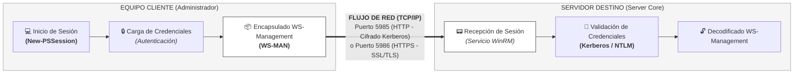

# Administración Remota (WinRM)

## 🎯 Relación con el Currículo (RA y CE)
La operación remota de servidores y el uso de shells seguros a través de la red constituyen el núcleo procedimental para la consecución de los siguientes objetivos del currículo oficial:

* **Resultado de Aprendizaje 4 (RA4):** Administra de forma remota el sistema operativo en red valorando su importancia y aplicando criterios de seguridad.
    * **CE1-RA4:** Se han descrito métodos de acceso y administración remota de sistemas (análisis de consolas locales, virtuales y servicios de red).
    * **CE3-RA4:** Se han utilizado herramientas de administración remota suministradas por el propio sistema operativo (uso nativo de `New-PSSession` y `Enter-PSSession`).
    * **CE5-RA4:** Se han utilizado comandos y herramientas gráficas para gestionar los servicios de acceso y administración remota (habilitación y control del servicio WinRM).
* **Resultado de Aprendizaje 7 (RA7) [Soporte Procedimental]:** Utiliza lenguajes de guiones en sistemas operativos, describiendo su aplicación y administrando servicios del sistema operativo.
    * **CE5-RA7:** Se han creado y probado guiones de administración de servicios (uso de bloques de comandos remotos desatendidos).
---

## 🏢 **¿Cómo accedemos al Shell de los Servidores?**

Cuando necesitamos conectarnos a un equipo servidor para proceder a su administración operativa, disponemos de cuatro opciones principales:

### 1. Acceso por Consola Local
* Conexión directa en el equipo físico (Teclado, monitor y ratón).
* Utilizado cuando no se dispone de acceso por red o durante instalaciones desde cero del sistema directamente sobre el hardware (sin entorno virtualizado).
* Permite supervisar todo el proceso de arranque del equipo, la información de la UEFI-BIOS y los gestores de inicio.

### 2. Acceso por Consola Virtualizada
* Conexión a través del terminal que ofrece el entorno de virtualización corporativo (**Proxmox VE** o Hyper-V).
* Muestra la misma información de inicio y acceso al equipo que la consola local, pero trabajando sobre hardware virtualizado.
* Requiere acceso previo por red a la interfaz web del virtualizador para poder abrir la consola de la máquina virtual.

### 3. Acceso Remoto por Servicios de Red
* Arquitectura Cliente/Servidor basada en protocolos de comunicación estándar a través de la red.
* Permite interactuar directamente con el Shell del sistema operativo destino (ej: **PowerShell Remoting** en Windows o **SSH** en Linux).
* Ofrece dos modalidades de trabajo: abrir un terminal remoto interactivo o lanzar comandos de forma desatendida a distancia (ej: mediante `Invoke-Command`).

### 4. Acceso mediante Servidor Intermedio
* Solución avanzada de seguridad para entornosempresariales (Servidor Bastión o *Jump Server*).
* El administrador realiza primero la conexión remota (SSH o PowerShell Remoting) hacia un servidor intermedio expuesto.
* Desde este equipo intermedio se realiza un "salto" interno hacia el servidor final que se encuentra aislado de la red externa.

---

## 📋 **Recomendaciones y Buenas Prácticas del Administrador**

* **Evitar consolas físicas/virtuales:** La conexión a la consola local o a la interfaz de Proxmox solo debe realizarse para instalaciones iniciales o mantenimientos concretos que requieran cortar el acceso a la red o modificar parámetros de la UEFI-BIOS.
* **Inseguridad del entorno gráfico remoto:** Las conexiones remotas mediante Escritorio Remoto (RDP) tradicional o VNC no se consideran eficientes ni completamente seguras en todos los escenarios de infraestructura, ya que saturan la red y la CPU de tráfico de vídeo innecesario. Para la administración corporativa se deben priorizar herramientas como la CLI de PowerShell o consolas de gestión web centralizadas como **Windows Admin Center**.
* **Securización perimetral:** El uso de servidores intermedios es aconsejable pero complejo. En su lugar, el uso de **PowerShell Remoting (WinRM)** o SSH es suficiente para la mayoría de escenarios, siempre que se complemente con conexiones encapsuladas y securizadas (como redes **VPN + IPSec**) cuando el acceso se realice desde fuera de la empresa (Internet).

---

## ⚙️ **PowerShell Remoting y el Protocolo WinRM**

Inyectando la filosofía de producción de un Centro de Procesamiento de Datos (CPD), los servidores suelen estar instalados en racks aislados dentro de salas frías. El personal técnico especializado interactúa con ellos a distancia desde sus puestos de trabajo a través del ecosistema de comunicaciones WinRM.

### 🧬 Arquitectura y Flujo de Red de PowerShell Remoting (WinRM)

#### Esquema Lógico de Comunicación Cliente-Servidor



!!! info "Nota sobre Seguridad"
    Esta arquitectura separa estrictamente las responsabilidades del sistema. El proceso de autenticación ocurre de forma segura en el servidor, y solo los resultados planos de salida se transmiten de vuelta por la red. La ejecución del comando o script en el host remoto permanece completamente aislada dentro de la sesión de usuario remota abierta.


WinRM es la implementación nativa de Microsoft del protocolo estándar **WS-Management (WS-MAN)**. Funciona encapsulando las instrucciones de automatización sobre paquetes estándar HTTP o HTTPS para su transmisión por la red bajo la pila TCP/IP.

* **Puerto WinRM HTTP (Por defecto):** Puerto `TCP 5985` (Autenticación cifrada nativa por Kerberos/NTLM).
* **Puerto WinRM HTTPS:** Puerto `TCP 5986` (Tráfico e identidades completamente cifrados mediante certificados SSL/TLS).

---

## 🛠️ Configuración Operativa en el Aula

Para implementar y validar el acceso remoto, supondremos que el equipo cliente (Windows 11 del alumno) y el servidor destino (Windows Server Core) se encuentran en la misma red, con IPs del mismo rango y dentro del mismo dominio.

### 1. Activación en el Servidor
Desde la consola local de Windows Server, se inicializa el motor de escucha remoto:

```powershell
Enable-PSRemoting -Force
```

### 2. Carga de Credenciales en el Cliente
Desde el Windows 11 del alumno, se capturan de forma segura las credenciales de administración para el viaje por la red:
```powershell
$credencial = Get-Credential
```

Nota: Este comando abrirá una ventana gráfica flotante en el cliente solicitando el usuario, por ejemplo, MIEMPRESA\Administrador y su contraseña correspondiente.

### 3. Apertura de una Sesión Interactiva (Enter-PSSession)
Establece un canal interactivo uno a uno persistente. El prompt de la terminal muta para indicar que estamos operando sobre el hardware del servidor Core:
```powershell
# Crear el túnel de sesión contra el servidor del laboratorio
$sesion = New-PSSession -ComputerName "192.168.10.10" -Credential $credencial

# Entrar en la sesión interactiva del servidor Core
Enter-PSSession -Session $sesion
```

Simulación de la respuesta esperada en la terminal del alumno:
```powershell
PS C:\Windows\system32> Enter-PSSession -Session $sesion
[192.168.10.10]: PS C:\Users\administrador\Documents> Get-Process
[192.168.10.10]: PS C:\Users\administrador\Documents> exit
PS C:\Windows\system32>
```
Para cerrar el canal interactivo y regresar al shell del equipo físico local, ejecuta:
```powershell
exit
```

### 4. Ejecución en Bloque Desatendida (Invoke-Command)
Es la herramienta idónea para la automatización paralela. Envía un bloque de código (-ScriptBlock), extrae el resultado hacia la terminal del alumno y destruye la conexión inmediatamente.

```powershell
# Obtener de forma remota las unidades de disco asignadas en el Server Core
Invoke-Command -ComputerName "192.168.10.10" -Credential $credencial -ScriptBlock { Get-PSDrive }
```

### 🔍 Laboratorio de Desafíos y Troubleshooting
### 💥 Caso Práctico: Error de resolución de Kerberos en conexiones fuera de dominio
Síntoma: Al intentar ejecutar New-PSSession o Invoke-Command utilizando el nombre del servidor (-ComputerName DC01), la terminal bloquea la conexión devolviendo un error crítico de WinRM que indica que el cliente no puede verificar la autenticidad del destino o que el SPN de Kerberos no se puede resolver.

Causa Raíz: Incumplimiento del requerimiento de pertenencia a dominio. WinRM utiliza por defecto el protocolo Kerberos para el mutuo acuerdo de autenticación segura. Si el ordenador Windows 11 físico del alumno se encuentra todavía en modo Workgroup (Grupo de trabajo) y el servidor Server Core ya ha sido promovido a Controlador de Dominio (DC), el protocolo Kerberos fallará al no poder validar el ticket de seguridad.

Solución Operativa en Clase: El alumno debe forzar el uso del mecanismo alternativo NTLM indicando la dirección IP explícita del servidor Core en lugar de su nombre DNS (ej: -ComputerName 192.168.10.10). Adicionalmente, para permitir que el sistema acepte credenciales de un entorno en el que no confía plenamente, se debe añadir dicha dirección IP al almacén de hosts seguros local del cliente ejecutando el siguiente comando con privilegios elevados:

```powershell
# Ejecutar en el Windows 11 cliente como ADMINISTRADOR LOCAL
Set-Item WSMan:\localhost\Client\TrustedHosts -Value "192.168.10.10" -Force

# Reiniciar el servicio local para aplicar la nueva política de confianza remota
Restart-Service WinRM
```

### 📚 Referencias y Fuentes Consultadas
!!! info "Documentación Oficial y Autoría"
    * **Material Base:** [Basado en la presentación académica y apuntes *UD3. Fundamentos de administración de Windows Server - Administración remota* desarrollados por el Departamento de Informática del IES Marcos Zaragoza](https://gvaedu-my.sharepoint.com/:b:/r/personal/jr_soria_edu_gva_es/Documents/MIS-APUNTES/ASO/GITHUB-AUX/Windows%20Server/Administracion-remota/UD3.%20Fundamentos%20de%20administraci%C3%B3n%20de%20Windows%20Server%20-%20Administracion%20remota.pdf?csf=1&web=1&e=RE3UE9).
* Docente Especialista / Autor: José Ramón Soria Nieto.
* Marco Modular: Contenidos curriculares oficiales vinculados al módulo de Administración de Sistemas Operativos (ASO) dentro del Ciclo Formativo de Grado Superior en Administración de Sistemas Informáticos en Red (ASIR/ASIX).

!!! abstract "Soporte Institucional y Fondos Europeos"
* Órgano Regulador: Generalitat Valenciana — Conselleria d'Educació, Cultura i Esport.
* Acreditación de Cofinanciación: Proyecto educativo y tecnológico cofinanciado por la Unión Europea a través del Fondo Social Europeo (FSE).
* «El FSE invierte en tu futuro» — Acciones destinadas al desarrollo de competencias técnicas avanzadas, fomento del empleo cualificado y digitalización de las aulas de Formación Profesional.