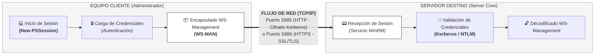
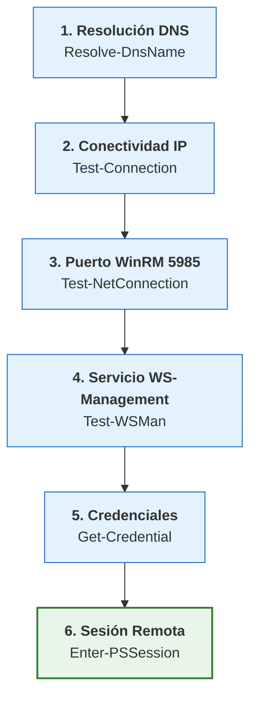

# Administración Remota (WinRM)

## 🎯 Relación con el Currículo (RA y CE)
La operación remota de servidores y el uso de shells seguros a través de la red constituyen el núcleo procedimental para la consecución de los siguientes objetivos del currículo oficial:

* **Resultado de Aprendizaje 4 (RA4):** Administra de forma remota el sistema operativo en red valorando su importancia y aplicando criterios de seguridad.
    * **CE1-RA4:** Se han descrito métodos de acceso y administración remota de sistemas (análisis de consolas locales, virtuales y servicios de red).
    * **CE3-RA4:** Se han utilizado herramientas de administración remota suministradas por el propio sistema operativo (uso nativo de `New-PSSession` y `Enter-PSSession`).
    * **CE5-RA4:** Se han utilizado comandos y herramientas gráficas para gestionar los servicios de acceso y administración remota (habilitación y control del servicio WinRM).
* **Resultado de Aprendizaje 7 (RA7) (Soporte Procedimental):** Utiliza lenguajes de guiones en sistemas operativos, describiendo su aplicación y administrando servicios del sistema operativo.
    * **CE5-RA7:** Se han creado y probado guiones de administración de servicios (uso de bloques de comandos remotos desatendidos).
---

## 🏢 **¿Cómo accedemos al Shell de los Servidores?**

Cuando necesitamos conectarnos a un equipo servidor para proceder a su administración operativa, disponemos de cuatro opciones principales:

### 1. Acceso por Consola Local
* Conexión directa en el equipo físico (Teclado, monitor y ratón).
* Utilizado cuando no se dispone de acceso por red o durante instalaciones desde cero del sistema directamente sobre el hardware (sin entorno virtualizado).
* Permite supervisar todo el proceso de arranque del equipo, la información de la UEFI-BIOS y los gestores de inicio.

### 2. Acceso por Consola Virtualizada
* Conexión a través del terminal que ofrece el entorno de virtualización corporativo (**Proxmox VE** o Hyper-V).
* Muestra la misma información de inicio y acceso al equipo que la consola local, pero trabajando sobre hardware virtualizado.
* Requiere acceso previo por red a la interfaz web del virtualizador para poder abrir la consola de la máquina virtual.

### 3. Acceso Remoto por Servicios de Red
* Arquitectura Cliente/Servidor basada en protocolos de comunicación estándar a través de la red.
* Permite interactuar directamente con el Shell del sistema operativo destino (ej: **PowerShell Remoting** en Windows o **SSH** en Linux).
* Ofrece dos modalidades de trabajo: abrir un terminal remoto interactivo o lanzar comandos de forma desatendida a distancia (ej: mediante `Invoke-Command`).

### 4. Acceso mediante Servidor Intermedio
* Solución avanzada de seguridad para entornos empresariales (Servidor Bastión o *Jump Server*).
* El administrador realiza primero la conexión remota (SSH o PowerShell Remoting) hacia un servidor intermedio expuesto.
* Desde este equipo intermedio se realiza un "salto" interno hacia el servidor final que se encuentra aislado de la red externa.

---

## 📋 **Recomendaciones y Buenas Prácticas del Administrador**

* **Evitar consolas físicas/virtuales:** La conexión a la consola local o a la interfaz de Proxmox solo debe realizarse para instalaciones iniciales o mantenimientos concretos que requieran cortar el acceso a la red o modificar parámetros de la UEFI-BIOS.
* **Inseguridad del entorno gráfico remoto:** Las conexiones remotas mediante Escritorio Remoto (RDP) tradicional o VNC no se consideran eficientes ni completamente seguras en todos los escenarios de infraestructura, ya que saturan la red y la CPU de tráfico de vídeo innecesario. Para la administración corporativa se deben priorizar herramientas como la CLI de PowerShell o consolas de gestión web centralizadas como **Windows Admin Center**.
* **Securización perimetral:** El uso de servidores intermedios es aconsejable pero complejo. En su lugar, el uso de **PowerShell Remoting (WinRM)** o SSH es suficiente para la mayoría de escenarios, siempre que se complemente con conexiones encapsuladas y securizadas (como redes **VPN + IPSec**) cuando el acceso se realice desde fuera de la empresa (Internet).

---

## ⚙️ **PowerShell Remoting y el Protocolo WinRM**

Inyectando la filosofía de producción de un Centro de Procesamiento de Datos (CPD), los servidores suelen estar instalados en racks aislados dentro de salas frías. El personal técnico especializado interactúa con ellos a distancia desde sus puestos de trabajo a través del ecosistema de comunicaciones WinRM.

### 🧬 Arquitectura y Flujo de Red de PowerShell Remoting (WinRM)

#### Esquema Lógico de Comunicación Cliente-Servidor


```mermaid
graph LR
    subgraph Cliente ["EQUIPO CLIENTE (Administrador)"]
        A["💻 Inicio de Sesión<br><b>(New-PSSession)</b>"] --> B["🔒 Carga de Credenciales<br><i>(Autenticación)</i>"]
        B --> C["📦 Encapsulado WS-Management<br><b>(WS-MAN)</b>"]
    end

    subgraph Servidor ["SERVIDOR DESTINO (Server Core)"]
        E["📟 Recepción de Sesión<br><i>(Servicio WinRM)</i>"] --> F["🔑 Validación de Credenciales<br><b>(Kerberos / NTLM)</b>"]
        F --> G["🔓 Decodificado WS-Management"]
    end

    C == "<b>FLUJO DE RED (TCP/IP)</b><br>Puerto 5985 (HTTP - Cifrado Kerberos)<br>o Puerto 5986 (HTTPS - SSL/TLS)" ==> E

    style Cliente fill:#f5f5f5,stroke:#999,stroke-width:1px
    style Servidor fill:#f5f5f5,stroke:#999,stroke-width:1px
    style C fill:#fff,stroke:#333,stroke-width:1px
    style E fill:#fff,stroke:#333,stroke-width:1px
```

!!! info "Nota sobre Seguridad"
    Esta arquitectura separa estrictamente las responsabilidades del sistema. El proceso de autenticación ocurre de forma segura en el servidor, y solo los resultados planos de salida se transmiten de vuelta por la red. La ejecución del comando o script en el host remoto permanece completamente aislada dentro de la sesión de usuario remota abierta.


WinRM es la implementación nativa de Microsoft del protocolo estándar **WS-Management (WS-MAN)**. Funciona encapsulando las instrucciones de automatización sobre paquetes estándar HTTP o HTTPS para su transmisión por la red bajo la pila TCP/IP.

* **Puerto WinRM HTTP (Por defecto):** Puerto `TCP 5985` (Autenticación cifrada nativa por Kerberos/NTLM).
* **Puerto WinRM HTTPS:** Puerto `TCP 5986` (Tráfico e identidades completamente cifrados mediante certificados SSL/TLS).

---

## 🛠️ **Configuración Operativa en el Aula**

Para implementar y validar el acceso remoto, supondremos que el equipo cliente (Windows 11 del alumno) y el servidor destino (Windows Server Core) se encuentran en la misma red, con IPs del mismo rango y dentro del mismo dominio.

### 1. Activación en el Servidor
Desde la consola local de Windows Server, se inicializa el motor de escucha remoto:

```powershell
Enable-PSRemoting -Force
```

!!! question "¿Qué hace realmente `Enable-PSRemoting`?"
    Este comando realiza varias acciones de configuración crítica en el servidor destino:

    * **Configura el Servicio WinRM:** Habilita e inicia el servicio de sistema `WinRM` (Windows Remote Management).
    * **Abre el Puerto TCP:** Configura el Firewall de Windows para permitir la entrada de tráfico en el puerto seleccionado (predeterminado `5985`).
    * **Crea la Sesión Local:** Genera la configuración necesaria para que el sistema pueda crear sesiones de administración remotas utilizando las credenciales locales del dominio o del equipo.
    * **Configura la Autenticación:** Establece las opciones de autenticación necesarias (Kerberos o NTLM) para verificar las identidades de los administradores que se conecten.

Una vez lanzado, no se debe volver a ejecutar, salvo que se realice algún cambio en la configuración de WinRM.

### 2. Comprobación del Servicio WinRM desde el Cliente (Test-WSMan)
Antes de solicitar credenciales o abrir túneles, la buena práctica dicta comprobar si el servicio WinRM del servidor está escuchando activamente y el puerto `5985` no está bloqueado por el firewall. Para ello, ejecutamos en el Windows 11 del alumno:

```powershell
# Comprobar la respuesta del servicio WS-Management en el host remoto
Test-WSMan -ComputerName "192.168.10.10"
```

Respuesta esperada en la consola del alumno:
```powershell
wsmid           : http://schemas.dmtf.org/wbem/wsman/identity/1/wsmanidentity.xsd
ProtocolVersion : OS: 10.0.20348 SP: 0.0 Stack: 3.0
ProductVendor   : Microsoft Corporation
ProductVersion  : OS: 10.0.20348 SP: 0.0 Stack: 3.0
```

> **Regla de Diagnóstico:** Si `Test-WSMan` responde con la versión del protocolo, sabemos con certeza que el servicio está activo y el tráfico TCP llega correctamente. Si devolviese un error de tiempo de espera (*timeout*), sabríamos de inmediato que la causa es de red o firewall, descartando problemas de autenticación o contraseñas.

### 3. Carga de Credenciales en el Cliente
Desde el Windows 11 del alumno, se capturan de forma segura las credenciales de administración para el viaje por la red:
```powershell
$credencial = Get-Credential
```

Nota: Este comando abrirá una ventana gráfica flotante en el cliente solicitando el usuario, por ejemplo, MIEMPRESA\Administrador y su contraseña correspondiente.

### 4. Apertura de una Sesión Interactiva (Enter-PSSession)
Establece un canal interactivo uno a uno persistente. El prompt de la terminal muta para indicar que estamos operando sobre el hardware del servidor Core:
```powershell
# Crear el túnel de sesión contra el servidor del laboratorio
$sesion = New-PSSession -ComputerName "192.168.10.10" -Credential $credencial

# Entrar en la sesión interactiva del servidor Core
Enter-PSSession -Session $sesion
```

Simulación de la respuesta esperada en la terminal del alumno:
```powershell
PS C:\Windows\system32> Enter-PSSession -Session $sesion
[192.168.10.10]: PS C:\Users\administrador\Documents> Get-Process
[192.168.10.10]: PS C:\Users\administrador\Documents> exit
PS C:\Windows\system32>
```
Para cerrar el canal interactivo y regresar al shell del equipo físico local, ejecuta:
```powershell
exit
```

---

## 🌐 **Windows Admin Center (WAC)**

Aunque WinRM y PowerShell Remoting son la base de la administración remota moderna, Microsoft ofrece **Windows Admin Center** como la evolución gráfica centralizada del tradicional "Administrador del servidor" (Server Manager) y las consolas MMC.

* **¿Qué es?** Es una aplicación basada en navegador web implementada de forma local para administrar servidores, clústeres, infraestructura hiperconvergente y equipos con Windows 10/11.
* **El complemento perfecto para Server Core:** Es la solución visual ideal para administrar servidores sin entorno gráfico (Server Core). Permite al administrador gestionar el servidor cómodamente desde su navegador, manteniendo el servidor destino ligero y seguro sin cargar el pesado escritorio de Windows.
* **¿Cómo funciona?** No requiere instalar "agentes" en los servidores que se van a administrar. WAC utiliza un servicio de puerta de enlace (Gateway) que **traduce las acciones de la interfaz web a comandos de PowerShell y WinRM** de forma subyacente hacia los nodos de destino.
* **Ventajas operativas:** Es gratuito y consolida herramientas clásicas (Visor de eventos, Administrador de dispositivos, Gestión de certificados, Roles y características, Firewall, etc.) en un portal web único, facilitando enormemente la administración frente al uso exclusivo de la línea de comandos.

### 📥 Instalación y Despliegue en el Aula

Para administrar nuestro servidor Server Core desde el equipo cliente (Windows 11), podemos instalar WAC directamente en nuestro Windows 11 (modo de despliegue local o de cliente):

1. **Descarga:** Obtén el instalador oficial (`.msi`) desde la página web de Microsoft [Windows Admin Center](https://www.microsoft.com/es-es/windows-server/windows-admin-center).
2. **Instalación:** Ejecuta el instalador en tu Windows 11. Durante el asistente, puedes dejar las opciones por defecto. Utilizará el puerto 6600 de forma predeterminada para el acceso web local.
3. **Acceso Inicial:** Una vez instalado, abre tu navegador web (Edge o Chrome son los recomendados) y accede a `https://localhost:6600` o abre el acceso directo creado en el menú inicio.
4. **Certificado de Seguridad:** Al acceder por primera vez, el navegador advertirá de que la conexión no es privada (por el certificado autofirmado que genera WAC). Debes aceptar el riesgo y continuar.
5. **Credenciales:** Se te solicitarán credenciales para acceder a WAC. Si estás en un dominio de AD y quieres administrar controladores de dominio, tendrás que logarte con cuentas administradoras del dominio.

### 🎮 Operación Básica: Gobernando el Servidor

Una vez dentro de la interfaz web de WAC, el proceso para tomar el control del Server Core es muy intuitivo:

1. **Añadir el Servidor:** En la página principal, haz clic en el botón **"+ Agregar"** y selecciona "Servidores".
2. **Datos de Conexión:** Introduce la dirección IP o el nombre DNS del servidor Server Core. Si el equipo cliente está en un dominio y buscar añadir el controlador de dominio en el que está, lo más fácil es buscar a partir de la opción de AD. WAC intentará detectar el equipo a través de la red usando WinRM subyacente.
3. **Credenciales:** Se te solicitarán las credenciales de administrador del servidor destino o usará directamente las proporcionadas para acceder a WAC.
4. **Administración Visual:** Haz clic sobre la conexión del servidor recién añadida. Se cargará el **Panel General**. A la izquierda tendrás un menú con todas las herramientas de gestión (Visor de eventos, Red, Archivos, Servicios, etc.), y a la derecha la interfaz visual de administración. 
5. **El poder de la CLI en la web:** Si prefieres ejecutar comandos, WAC incluye una herramienta llamada **"PowerShell"** en la parte superior derecha que abre una consola interactiva web directamente contra el servidor, todo sin salir del navegador.
6. **Cerrar sesión:** Una vez que hayas terminado de administrar el servidor, cierra sesión en WAC haciendo clic en el icono de perfil y seleccionando "Cerrar sesión".

#### 🎬 Vídeo demostración: Instalación y primeros pasos en WAC

Vídeo complementario con la instalación y primer uso de la herramienta Windows Admin Center desde un equipo cliente.

<div class="video-embed">
  <iframe 
    src="https://www.youtube.com/embed/6w2F0RmmUDQ"
    title="Instalación y primer uso de Windows Admin Center"
    allow="accelerometer; autoplay; clipboard-write; encrypted-media; gyroscope; picture-in-picture; web-share" 
    allowfullscreen>
  </iframe>
</div>

!!! info "Ver en YouTube"
    Si prefieres abrir el tutorial directamente en la plataforma o guardarlo en tus listas de reproducción, puedes acceder a través del siguiente enlace:  
    **[▶ Abrir vídeo directamente en YouTube](https://youtu.be/6w2F0RmmUDQ)**

---

#### 🎬 Vídeo demostración: Acceso a terminal Powershell remoto desde WAC

Vídeo complementario con el acceso a terminal Powershell remoto desde WAC instalado en pc cliente.

<div class="video-embed">
  <iframe 
    src="https://www.youtube.com/embed/BPB3ew7zeCM"
    allow="accelerometer; autoplay; clipboard-write; encrypted-media; gyroscope; picture-in-picture; web-share" 
    allowfullscreen>
  </iframe>
</div>

!!! info "Ver en YouTube"
    Si prefieres abrir el tutorial directamente en la plataforma o guardarlo en tus listas de reproducción, puedes acceder a través del siguiente enlace:  
    **[▶ Abrir vídeo directamente en YouTube](https://youtu.be/BPB3ew7zeCM)**

---

## 🧭 **Estrategias y Grados de Administración Remota: De RSAT a la Sesión Interactiva**

En la administración profesional de servidores (y muy especialmente en **Controladores de Dominio**), acceder por consola interactiva a un servidor **no debe ser la primera opción, sino el último recurso**.

Cada sesión interactiva abierta carga perfiles de usuario en memoria, expone credenciales y tokens de seguridad en el servidor de destino y resulta ineficiente al no ser escalable ni paralelizable. La ingeniería de sistemas moderna establece una jerarquía de acceso donde **siempre se prioriza el nivel con menor impacto sobre el servidor**.

### 📊 Comparativa de los Tres Grados de Acceso Remoto

| Nivel de Acceso | Mecanismo y Herramientas | Protocolo / Canal de Red | Cuándo Utilizarlo (Criterio Operativo) |
| :--- | :--- | :--- | :--- |
| **Nivel 1: Módulos de Servicio / RSAT** *(Prioridad Máxima)* | Cmdlets locales de módulos de administración (`ActiveDirectory`, `DnsServer`, `DhcpServer`). | Protocolos directos de servicio (LDAP en TCP 389/636, ADWS en TCP 9389, RPC/DNS en TCP 53). **Sin WinRM**. | **El 90% del día a día:** Altas y bajas de usuarios, modificación de grupos, restablecimiento de contraseñas y gestión de registros DNS desde el equipo de gestión del administrador. |
| **Nivel 2: Ejecución Remota Desatendida** *(Automatización y Escala)* | `Invoke-Command`, comandos con `-ComputerName`, o consultas CIM (`Get-CimInstance`). | WinRM (TCP 5985/5986) encapsulando WS-Management. Conexión de corta duración. | **Mantenimiento e inventario masivo:** Ejecutar scripts en segundo plano sobre uno o decenas de servidores en paralelo (ej. reiniciar un servicio o comprobar discos) y cerrar la conexión al instante. |
| **Nivel 3: Sesión Interactiva en Tiempo Real** *(Último Recurso)* | `Enter-PSSession`, consola web PowerShell de Windows Admin Center. | WinRM interactivo con asignación de terminal virtual (1 a 1). | **Diagnóstico y Troubleshooting en vivo:** Exclusivamente cuando algo falla de forma imprevista y el técnico necesita inspeccionar paso a paso el estado interno del servidor. |

---

### 1. Nivel 1: Módulos de Servicio y RSAT (Sin sesión en el servidor)

En un entorno corporativo, el administrador no abre una sesión de terminal en el servidor cada vez que necesita gestionar un usuario o un registro DNS. En su lugar, utiliza las herramientas **RSAT (*Remote Server Administration Tools*)** instaladas en su propio puesto de trabajo (Windows 11).

#### 📦 Instalación de las RSAT en el Cliente Windows 11

Por defecto, las herramientas RSAT **no vienen instaladas** en Windows 11, ya que se consideran herramientas especializadas de administración. Son **características opcionales** (*Features on Demand* o características a petición de Microsoft, lo que significa que el propio sistema las descarga de Windows Update sin requerir instaladores `.msu` externos).

##### Método Gráfico: Desde la Configuración de Windows 11 (Recomendado)

En un equipo de escritorio cliente, la forma más directa e intuitiva de instalarlas es a través de la interfaz gráfica del sistema:

1. Abrir **Configuración** en Windows 11 (`Win + I`).
2. Ir a **Sistema** (o **Aplicaciones** en versiones previas de Windows 11) > **Características opcionales**.
3. En la sección *Agregar una característica opcional*, pulsar en el botón **Ver características** (o *Agregar característica*).
4. En el buscador, escribir `RSAT` para filtrar todas las herramientas de administración disponibles y marcar las necesarias:
    - **Herramientas de Active Directory Domain Services y Lightweight Directory Services** (incluye las consolas como *Usuarios y equipos de AD* y el módulo de PowerShell `ActiveDirectory`).
    - **Herramientas del Servidor DNS** (consola DNS y módulo `DnsServer`).
    - **Herramientas de Administración de directivas de grupo** (consola GPMC y módulo `GroupPolicy`).
    - **Herramientas del Administrador del servidor** (*Server Manager* y utilidades base).
5. Pulsar en **Siguiente** e **Instalar**. Windows las descargará e integrará automáticamente en el sistema.

??? note "Alternativa por consola: Instalación desatendida mediante PowerShell (Automatización)"
    Si necesitas aprovisionar de forma automática varios puestos o un aula completa sin interactuar con la interfaz gráfica, puedes instalarlas desde una consola de **PowerShell como Administrador** con el cmdlet `Add-WindowsCapability`:

    ```powershell
    # 1. Herramientas de Active Directory
    Add-WindowsCapability -Online -Name "Rsat.ActiveDirectory.DS-LDS.Tools~~~~0.0.1.0"

    # 2. Herramientas de DNS
    Add-WindowsCapability -Online -Name "Rsat.Dns.Tools~~~~0.0.1.0"

    # 3. Herramientas de Directivas de Grupo (GPMC)
    Add-WindowsCapability -Online -Name "Rsat.GroupPolicy.Management.Tools~~~~0.0.1.0"

    # 4. Herramientas del Administrador del Servidor
    Add-WindowsCapability -Online -Name "Rsat.ServerManager.Tools~~~~0.0.1.0"
    ```

    O bien instalarlas en bloque con una única tubería (*pipeline*):
    ```powershell
    Get-WindowsCapability -Online | Where-Object { 
        $_.Name -like "Rsat.ActiveDirectory*" -or 
        $_.Name -like "Rsat.Dns*" -or 
        $_.Name -like "Rsat.GroupPolicy*" -or 
        $_.Name -like "Rsat.ServerManager*" 
    } | Add-WindowsCapability -Online
    ```

Una vez instaladas (ya sea por la interfaz gráfica o por consola), las consolas de gestión estarán disponibles en el menú Inicio (o en *Herramientas de Windows*) y los módulos quedarán registrados de forma permanente en PowerShell. Podemos verificar la disponibilidad del módulo de Active Directory ejecutando:

```powershell
# Comprobar la disponibilidad del módulo en la máquina cliente
Get-Module -ListAvailable ActiveDirectory
```

#### 🎬 Vídeo demostración: Instalación de características RSAT en Windows para acceso remoto mediante herramientas y powershell

Vídeo complementario con el proceso paso a paso para la instalación de características RSAT en Windows para acceso remoto mediante herramientas y PowerShell.

<div class="video-embed">
  <iframe 
    src="https://www.youtube.com/embed/JvGKMo1NUDg" 
    title="Instalación de características RSAT en Windows para acceso remoto mediante herramientas y powershell" 
    allow="accelerometer; autoplay; clipboard-write; encrypted-media; gyroscope; picture-in-picture; web-share" 
    allowfullscreen>
  </iframe>
</div>

!!! info "Ver en YouTube"
    Si prefieres abrir el tutorial directamente en la plataforma o guardarlo en tus listas de reproducción, puedes acceder a través del siguiente enlace:  
    **[▶ Abrir vídeo directamente en YouTube](https://youtu.be/JvGKMo1NUDg)**

---

#### 🛠️ Operación Diaria desde el Puesto del Administrador

Una vez dotado el cliente de las RSAT, los comandos se ejecutan en local en la máquina del técnico, y es el propio módulo de PowerShell el que se comunica con el servidor a través de los puertos y servicios específicos del rol:

```powershell
# Ejecutado en el Windows 11 cliente (sin sesión remota previa)
# El cmdlet contacta con el DC mediante Active Directory Web Services (puerto 9389)
Get-ADUser -Identity "lperez" -Properties AccountExpirationDate, Enabled

# Modificar propiedades del usuario de forma directa y transparente:
Set-ADUser -Identity "lperez" -Description "Alumno de 1º ASIX - Aula 01"

# Comprobar el cambio solicitando el atributo específico (no viene por defecto):
Get-ADUser -Identity "lperez" -Properties Description | Select-Object Name, Description

# Consultar registros del servicio DNS integrado en el dominio (indicando el servidor):
Get-DnsServerResourceRecord -ZoneName "int.asix.info" -RRType "A" -ComputerName "dc01.int.asix.info"
```

> **Ventaja de Seguridad y Rendimiento:** El Controlador de Dominio no ejecuta shells de PowerShell de usuario ni almacena sesiones interactivas, reduciendo drásticamente la superficie de ataque y el consumo de recursos.

---

### 2. Nivel 2: Ejecución Desatendida en Bloque (`Invoke-Command` y CIM)

Cuando la tarea requiere consultar o manipular el propio sistema operativo anfitrión (procesos, servicios del sistema, volúmenes de disco o actualizaciones) y no solo la base de datos de un rol, la opción idónea es **lanzar comandos desatendidos**.

El cmdlet `Invoke-Command` abre un canal WinRM temporal contra el servidor, envía un bloque de código (`-ScriptBlock`), recopila los resultados estructurados hacia la consola del alumno y **cierra y destruye la sesión inmediatamente**:

```powershell
# Comprobar el estado de servicios críticos en el servidor sin entrar a él:
Invoke-Command -ComputerName "192.168.10.10" -Credential $credencial -ScriptBlock {
    Get-Service -Name NTDS, DNS, WinRM | Select-Object Name, Status, StartType
}

# Consultar el espacio libre en el volumen del sistema (C:) del servidor:
Invoke-Command -ComputerName "192.168.10.10" -Credential $credencial -ScriptBlock {
    Get-Volume -DriveLetter C | Select-Object DriveLetter,
        @{Name="Total_GB"; Expression={[math]::Round($_.Size / 1GB, 2)}},
        @{Name="Libre_GB"; Expression={[math]::Round($_.SizeRemaining / 1GB, 2)}}
}

# Pasar una variable local del cliente al servidor remoto usando el prefijo $using:
$nuevaCarpeta = "C:\Auditoria"
Invoke-Command -ComputerName "192.168.10.10" -Credential $credencial -ScriptBlock {
    New-Item -Path $using:nuevaCarpeta -ItemType Directory -Force
}

# Auditoría multilínea compleja (ejecuta varios comandos secuenciales y devuelve un objeto):
Invoke-Command -ComputerName "192.168.10.10" -Credential $credencial -ScriptBlock {
    # 1. Detectar servicios automáticos que hayan fallado o estén detenidos:
    $serviciosCaidos = Get-Service | Where-Object { $_.StartType -eq 'Automatic' -and $_.Status -ne 'Running' }

    # 2. Medir espacio libre restante en el disco C:
    $espacioLibre = (Get-Volume -DriveLetter C).SizeRemaining / 1GB

    # 3. Empaquetar el resultado estructurado para enviarlo de vuelta al cliente:
    [PSCustomObject]@{
        Servidor       = $env:COMPUTERNAME
        EspacioLibreGB = [math]::Round($espacioLibre, 2)
        EstadoServicios= if ($serviciosCaidos) { $serviciosCaidos.Name -join ", " } else { "Todos OK" }
    }
}

# Consultar información de hardware o sistema operativo mediante CIM:
Get-CimInstance -ClassName Win32_OperatingSystem -ComputerName "192.168.10.10" | 
    Select-Object CSName, Caption, LastBootUpTime

# Consultar memoria RAM física total y procesadores del servidor:
Get-CimInstance -ClassName Win32_ComputerSystem -ComputerName "192.168.10.10" | 
    Select-Object Manufacturer, Model, 
        @{Name="RAM_Total_GB"; Expression={[math]::Round($_.TotalPhysicalMemory / 1GB, 2)}}, 
        NumberOfLogicalProcessors

# Consultar número de serie y versión de BIOS (ideal para inventario de máquinas):
Get-CimInstance -ClassName Win32_BIOS -ComputerName "192.168.10.10" | 
    Select-Object Manufacturer, SMBIOSBIOSVersion, SerialNumber
```

> **Escalabilidad 1 a N:** A diferencia de una sesión interactiva, `Invoke-Command` admite pasar una lista separada por comas en `-ComputerName` (o extraerla de Active Directory con `Get-ADComputer`), permitiendo auditar o configurar decenas de servidores de forma simultánea en pocos segundos.

---

### 3. Nivel 3: Sesión Interactiva en Vivo (`Enter-PSSession` y WAC)

Consiste en el establecimiento de un canal interactivo bidireccional y continuo mediante WinRM que vincula la entrada y salida de nuestra consola a un proceso de shell ejecutado en el servidor remoto. Como se comprobó durante la validación inicial en el apartado [*Configuración Operativa en el Aula*](#configuracion-operativa-en-el-aula), el indicador de comandos (*prompt*) muta anteponiendo la identidad o IP del host (por ejemplo, `[192.168.10.10]: PS >`), reflejando que el contexto de ejecución pasa a ser el del sistema operativo remoto.

A diferencia de la ejecución desatendida del Nivel 2, una sesión interactiva mantiene un espacio de ejecución (*runspace*) y un consumo persistente de memoria en el servidor hasta su cierre explícito, por lo que debe reservarse a intervenciones exploratorias o resolución de incidencias en tiempo real (*troubleshooting*).

```powershell
# Abrir canal interactivo de emergencia o diagnóstico:
Enter-PSSession -ComputerName "192.168.10.10" -Credential $credencial

# [192.168.10.10]: PS C:\Users\jrsoria\Documents> ... Tareas exploratorias en vivo ...

# OBLIGATORIO: Al finalizar la intervención, cerrar y liberar la sesión interactiva:
exit
```

!!! tip "Criterio Profesional para el Administrador de Sistemas"
    * **Para tareas del servicio (AD, DNS, DHCP):** Emplea siempre los módulos específicos de **RSAT** desde tu puesto de gestión.
    * **Para automatización, auditoría y mantenimiento del SO:** Emplea scripts desatendidos con **`Invoke-Command`** o **WMI/CIM**.
    * **Para incidencias críticas no diagnosticadas:** Emplea **`Enter-PSSession`** o la consola CLI de Windows Admin Center, cerrando la sesión tan pronto concluya el análisis.

#### 🎬 Vídeo demostración: Acceso remoto sin abrir sesiones

Vídeo complementario con la demostración práctica de las técnicas de administración y acceso remoto en Windows Server sin abrir sesiones interactivas.

<div class="video-embed">
  <iframe 
    src="https://www.youtube.com/embed/HUQvDOMFe1I" 
    title="Windows Server - Acceso remoto sin abrir sesiones" 
    allow="accelerometer; autoplay; clipboard-write; encrypted-media; gyroscope; picture-in-picture; web-share" 
    allowfullscreen>
  </iframe>
</div>

!!! info "Ver en YouTube"
    Si prefieres abrir el tutorial directamente en la plataforma o guardarlo en tus listas de reproducción, puedes acceder a través del siguiente enlace:  
    **[▶ Abrir vídeo directamente en YouTube](https://youtu.be/HUQvDOMFe1I)**

---

## 🛡️ **Seguridad en la Administración: Cuentas Nominativas vs. Cuenta Administrador**

En la gestión profesional de infraestructuras IT, **evitar el uso de la cuenta integrada predeterminada `Administrador`** es un principio elemental de bastionado y cumplimiento de normativas de seguridad (como el Esquema Nacional de Seguridad o ISO 27001).

### 🎯 Justificación Técnica y Criterios de Seguridad

1. **Auditoría y Trazabilidad (No repudio):**  
   Si todas las operaciones de mantenimiento se ejecutan bajo la cuenta genérica `Administrador`, el Visor de Eventos de Windows (`Security.evtx`) registrará los eventos críticos (inicios de sesión interactivos, modificaciones en Active Directory, detención de servicios o elevación de privilegios) sin identificar a la persona física responsable. El uso de cuentas nominativas (como `jrsoria`) garantiza la autoría inequívoca de cada acción.
2. **Mitigación de Ataques de Fuerza Bruta:**  
   La cuenta `Administrador` cuenta con un identificador relativo fijo y universal (`RID 500`). Los atacantes conocen este nombre por defecto y dirigen hacia él sus intentos de autenticación mediante fuerza bruta o ataques de diccionario.
3. **Principio de Menor Privilegio y Cuentas Dedicadas:**  
   En un entorno empresarial real, un técnico dispone de al menos dos identidades:

    * **Cuenta estándar:** Empleada en las tareas de ofimática, navegación web y correo diario (sin privilegios administrativos).
    * **Cuenta de administración:** Utilizada exclusivamente para operar consolas de gestión o conexiones remotas (por ejemplo, `adm_jrsoria` o `jrsoria-adm`).

   En nuestro entorno de aula, dotaremos al usuario `jrsoria` de privilegios administrativos para ilustrar el control de acceso remoto nominal sin necesidad de recurrir a la cuenta global `Administrador`.

---

### 💻 Concesión de Permisos de Administración mediante PowerShell

Dado que nuestro servidor Windows Server 2025 está promovido a **Controlador de Dominio (DC)** del dominio  **int.asix.info**, las identidades, grupos y permisos administrativos se gestionan de forma centralizada mediante **Active Directory**.

Desde PowerShell podemos administrar estos elementos utilizando los cmdlets proporcionados por el módulo **ActiveDirectory**.

#### 1. Asignación al Grupo Principal de Administración

Para determinadas tareas del laboratorio puede ser necesario proporcionar a un usuario privilegios administrativos completos sobre el dominio.

Para ello podemos incorporarlo al grupo global **Domain Admins** (*Administradores del dominio*):

```powershell
# Añadir el usuario al grupo de Administradores del Dominio
Add-ADGroupMember -Identity "Domain Admins" -Members "jrsoria"
```

> **Nota sobre el idioma del SO:** dependiendo del idioma y de la forma en que se haya desplegado Active Directory, algunos grupos pueden aparecer con su nombre localizado, por ejemplo, **"Administradores del dominio"** en lugar de **"Domain Admins"**.

Los miembros de Domain Admins disponen de privilegios administrativos elevados sobre Active Directory, los controladores de dominio y, por defecto, los equipos unidos al dominio.

!!! warning "Principio de mínimo privilegio"
    La pertenencia a Domain Admins proporciona un nivel de privilegio muy elevado.

    En un entorno de producción no es recomendable utilizar de forma habitual una cuenta personal como miembro permanente de este grupo. Siempre que sea posible deben utilizarse **cuentas administrativas específicas** y mecanismos de **delegación de permisos**, concediendo únicamente los privilegios necesarios para realizar cada tarea.


#### 2. Delegación de Funciones Administrativas

No todas las tareas de administración requieren pertenecer al grupo **Domain Admins**.

Active Directory dispone de grupos específicos que permiten delegar determinadas funciones administrativas.

Por ejemplo:

* **DnsAdmins:** permite administrar el servicio DNS instalado en los controladores de dominio.
* **Group Policy Creator Owners:** permite crear nuevos Objetos de Directiva de Grupo (GPO) y administrar los GPO creados por sus miembros.

Podemos añadir un usuario a estos grupos mediante:

```powershell
# Delegar administración del servicio DNS
Add-ADGroupMember -Identity "DnsAdmins" -Members "jrsoria"

# Permitir la creación de Objetos de Directiva de Grupo
Add-ADGroupMember -Identity "Group Policy Creator Owners" -Members "jrsoria"
```

!!! info "Domain Admins frente a administración delegada"

    Si un usuario ya pertenece a **Domain Admins**, normalmente no es necesario añadirlo también a DnsAdmins o Group Policy Creator Owners, ya que dispone de privilegios superiores.

Estos grupos resultan especialmente útiles cuando queremos aplicar el **principio de mínimo privilegio** y permitir que un administrador gestione únicamente determinados servicios.

La pertenencia a Group Policy Creator Owners tampoco concede automáticamente permiso para vincular GPO a cualquier Unidad Organizativa.

La capacidad de vincular una GPO depende de los permisos existentes sobre el dominio, sitio o Unidad Organizativa correspondiente.

#### 3. Verificación de Membresía desde la CLI

Podemos comprobar los grupos de seguridad a los que pertenece un usuario mediante:

```powershell
# Listar los grupos a los que pertenece el usuario
Get-ADPrincipalGroupMembership -Identity "jrsoria" | Select-Object Name
```

También podemos mostrar información adicional, como el ámbito de cada grupo:

```powershell
Get-ADPrincipalGroupMembership -Identity "jrsoria" | Select-Object Name,GroupScope
```

Esto permite verificar que la delegación administrativa se ha realizado correctamente.

---

### 🚀 Operación Remota y Renovación de Credenciales

Una vez configurados los privilegios administrativos de una cuenta, podemos utilizarla para administrar los servidores tanto desde la interfaz web de **Windows Admin Center (WAC)** como en sesiones interactivas de **PowerShell Remoting**:

#### 1. Sintaxis de Autenticación:

Al proporcionar las credenciales de un usuario del dominio pueden utilizarse normalmente dos formatos:

* **Formato NetBIOS:** `INT\jrsoria`  
    O según el nombre NetBios que se le diera al dominio durante la instalación.
* **Formato UPN (User Principal Name):** `jrsoria@int.asix.info`

Por ejemplo:

```powershell
$cred = Get-Credential "INT\jrsoria"
```

O:

```powershell
$cred = Get-Credential "jrsoria@int.asix.info"
```

#### 2. Actualización de los tickets Kerberos  

Cuando un usuario inicia sesión en un equipo unido al dominio obtiene diferentes **tickets Kerberos** que permiten acceder a los recursos de la red.

Si posteriormente modificamos su pertenencia a grupos administrativos, los tickets existentes pueden seguir conteniendo información correspondiente a la situación anterior.

Esto puede provocar temporalmente **errores de Acceso denegado** al intentar utilizar servicios como WinRM o Windows Admin Center.

Podemos consultar los tickets Kerberos almacenados actualmente mediante:

```powershell
klist
```

Para eliminar los tickets almacenados en caché:

```powershell
klist purge
```

Al acceder posteriormente a un recurso del dominio, el cliente solicitará nuevos tickets Kerberos.

!!! warning "Tickets Kerberos y token de acceso"
    Los tickets Kerberos y el token de acceso de Windows no son exactamente lo mismo. 
    
    `klist purge` elimina los tickets Kerberos almacenados en caché, pero determinados cambios de pertenencia a grupos o privilegios pueden requerir **cerrar la sesión del usuario y volver a iniciarla** para que Windows genere un nuevo token de acceso.
---

### 🔍 Laboratorio de Desafíos y Troubleshooting

### 💥 Caso Práctico: administración remota desde un equipo fuera del dominio

Supongamos el siguiente escenario:

* **DC01.int.asix.info** es un Windows Server 2025 Server Core.
* El servidor ha sido promovido a Controlador de Dominio.
* El dominio es **int.asix.info**.
* El equipo Windows 11 utilizado por el alumno todavía pertenece a un grupo de trabajo (Workgroup).

El alumno intenta establecer una sesión remota:

```powershell
# Entrar en sesión remota
Enter-PSSession -ComputerName DC01 -Credential INT\jrsoria
```
o 

```powershell
# Crear sesión remota
New-PSSession -ComputerName DC01 -Credential INT\jrsoria
```

y recibe un error relacionado con WinRM, autenticación o imposibildad de verificar la identidad del servidor remoto.


🔎 Análisis del problema

En equipos pertenecientes al dominio, PowerShell Remoting puede utilizar **Kerberos** para proporcionar autenticación segura entre cliente y servidor.

Kerberos ofrece **autenticación mutua**:

* el servidor verifica la identidad del usuario;
* el cliente puede verificar la identidad del servidor.

Cuando el equipo cliente se encuentra en un **Workgroup**, no dispone de la misma relación de confianza con Active Directory.

Esto no impide utilizar PowerShell Remoting, pero será necesario utilizar otros mecanismos de autenticación y establecer explícitamente qué servidores remotos consideramos de confianza.

Una situación similar se produce cuando especificamos el servidor mediante su dirección IP:

```powershell
Enter-PSSession -ComputerName 192.168.10.10
```

Al utilizar una dirección IP, Kerberos normalmente no puede utilizarse para autenticar el servidor mediante sus nombres registrados en Active Directory.

En estos casos WinRM puede recurrir a **NTLM**.

#### 🔐 Configuración de TrustedHosts

Cuando no podemos utilizar la autenticación mutua proporcionada por Kerberos, podemos indicar al cliente WinRM qué servidores remotos consideramos confiables mediante la propiedad TrustedHosts.

Desde el equipo Windows 11 cliente, ejecutaremos PowerShell con privilegios de Administrador local:

```powershell
Set-Item WSMan:\localhost\Client\TrustedHosts `
    -Value "192.168.10.10" `
    -Force
```

Podemos comprobar posteriormente la configuración:

```powershell
Get-Item WSMan:\localhost\Client\TrustedHosts
```

La lista mostrará los servidores remotos en los que el cliente permite establecer conexiones aunque su identidad no pueda comprobarse mediante Kerberos.

!!! warning "Seguridad de TrustedHosts"
    Debemos limitar TrustedHosts únicamente a los equipos necesarios.

    No es recomendable configurar:

    ```powershell
        Set-Item WSMan:\localhost\Client\TrustedHosts -Value "*"
    ```

    ya que esto indicaría al cliente que confía en cualquier servidor remoto.

### 🧭 Procedimiento de diagnóstico recomendado

Cuando una conexión de PowerShell Remoting falla, **no debemos modificar directamente `TrustedHosts`** sin determinar antes en qué capa del flujo de comunicación se encuentra el problema. Modificar listas de confianza sin diagnosticar enmascara fallos de red, DNS o configuración del cortafuegos.

!!! tip "Metodología de Diagnóstico por Capas"
    Se recomienda seguir un orden progresivo (*bottom-up*): desde la resolución de nombres y conectividad IP básica, pasando por el puerto y el servicio WinRM, hasta la validación de credenciales y la apertura de sesión.


```mermaid
graph TD
    A["<b>1. Resolución DNS</b><br>Resolve-DnsName"] --> B["<b>2. Conectividad IP</b><br>Test-Connection"]
    B --> C["<b>3. Puerto WinRM 5985</b><br>Test-NetConnection"]
    C --> D["<b>4. Servicio WS-Management</b><br>Test-WSMan"]
    D --> E["<b>5. Credenciales</b><br>Get-Credential"]
    E --> F["<b>6. Sesión Remota</b><br>Enter-PSSession"]
    
    style A fill:#e3f2fd,stroke:#1565c0,stroke-width:1px
    style B fill:#e3f2fd,stroke:#1565c0,stroke-width:1px
    style C fill:#e3f2fd,stroke:#1565c0,stroke-width:1px
    style D fill:#e3f2fd,stroke:#1565c0,stroke-width:1px
    style E fill:#e3f2fd,stroke:#1565c0,stroke-width:1px
    style F fill:#e8f5e9,stroke:#2e7d32,stroke-width:2px
```

A continuación se detalla cada una de las fases del procedimiento:

1. **Comprobar la resolución de nombres DNS**

    Verificar que el equipo cliente puede resolver con éxito el nombre completo (FQDN) del servidor de destino a su dirección IP correcta. Sin resolución DNS válida, Kerberos no podrá solicitar ni generar los tickets de servicio (SPN):

    ```powershell
    Resolve-DnsName DC01.int.asix.info
    ```

    * **Objetivo:** Comprobar que la respuesta devuelva la dirección IP esperada del servidor.
    * **Si falla:** Revisar los servidores DNS configurados en el adaptador de red del cliente o el registro de zona en el servidor DNS del dominio.

2. **Comprobar la conectividad IP básica**

    Validar la comunicación directa a nivel de red (paquetes ICMP) entre el cliente y el servidor:

    ```powershell
    Test-Connection DC01.int.asix.info -Count 2
    ```

    * **Objetivo:** Confirmar que no existen cortes físicos de enlace, rutas de red erróneas o aislamiento entre subredes.
    * **Si falla:** Comprobar la configuración IP local, la puerta de enlace predeterminada o reglas perimetrales que bloqueen ICMP.

3. **Comprobar el puerto de escucha de WinRM (TCP 5985)**

    Comprobar que el socket TCP del servicio WinRM está abierto y accesible a través del cortafuegos:

    ```powershell
    Test-NetConnection DC01.int.asix.info -Port 5985
    ```

    * **Objetivo:** Validar que el resultado indique `TcpTestSucceeded : True`.
    * **Si falla:** El cortafuegos de Windows Server o un cortafuegos intermedio está bloqueando el tráfico entrante al puerto `5985`.

4. **Comprobar el servicio WS-Management (WinRM)**

    Enviar una consulta nativa de capa de aplicación WS-MAN para verificar que el demonio WinRM está activo y responde a peticiones de gestión:

    ```powershell
    Test-WSMan DC01.int.asix.info
    ```

    * **Objetivo:** Obtener la identificación del protocolo y producto (`wsmid`, `ProtocolVersion`, `ProductVendor: Microsoft Corporation`).
    * **Si falla:** El servicio `WinRM` está detenido en el servidor o no se ha inicializado mediante `Enable-PSRemoting`.

5. **Comprobar las credenciales utilizadas**

    Almacenar y validar de forma explícita las credenciales del usuario con privilegios administrativos:

    ```powershell
    $cred = Get-Credential "INT\jrsoria"
    ```

    * **Objetivo:** Asegurar que el nombre de usuario utiliza el formato adecuado (`DOMINIO\usuario` o `usuario@dominio.info`) y que la contraseña es correcta.
    * **Si falla:** Verificar que la cuenta no se encuentre bloqueada o con la contraseña caducada en Active Directory.

6. **Intentar establecer la sesión remota interactiva**

    Una vez validadas con éxito las fases anteriores, proceder a la conexión remota con el servidor:

    ```powershell
    Enter-PSSession `
        -ComputerName DC01.int.asix.info `
        -Credential $cred
    ```

    * **Objetivo:** Acceder al prompt interactivo remoto del servidor: `[DC01.int.asix.info]: PS C:\Users\...`.

---

#### 📌 Kerberos frente a NTLM en PowerShell Remoting

Si el cliente no pertenece al dominio y la autenticación mutua Kerberos no puede emplearse, podemos configurar el servidor en la directiva local `TrustedHosts` y realizar la conexión utilizando credenciales explícitas.

De forma simplificada podemos considerar los siguientes escenarios de autenticación:

| Escenario de Conexión | Autenticación Habitual | ¿Requiere `TrustedHosts`? |
| :--- | :--- | :--- |
| **Cliente y servidor unidos al mismo dominio** | Kerberos | ❌ No necesario |
| **Dominios con relación de confianza** | Kerberos | ❌ Normalmente no |
| **Cliente en Workgroup (Grupo de trabajo)** | NTLM | ⚠️ Puede ser necesario |
| **Conexión mediante dirección IP** | NTLM | ⚠️ Puede ser necesario |
| **WinRM mediante HTTPS (Puerto 5986)** | TLS + Autenticación | ❌ No necesariamente |

Siempre que sea posible, en una infraestructura empresarial basada en Active Directory debemos preferir el modelo nativo frente a soluciones basadas en excepciones manuales:

!!! success "Arquitectura Recomendada (Dominio + Kerberos)"
    **Flujo corporativo óptimo:**
    
    `Nombre DNS / FQDN` ➔ `Resolución DNS correcta` ➔ `Kerberos (SPN)` ➔ `Autenticación mutua`
    
    Aprovecha la infraestructura de seguridad centralizada de Active Directory: la identidad del servidor queda plenamente garantizada y no requiere tocar configuraciones locales en los clientes.

!!! warning "Modelo de Contingencia (IP / Workgroup + NTLM)"
    **Flujo de contingencia:**
    
    `Dirección IP` ➔ `Sin SPN de Dominio` ➔ `Degradación a NTLM` ➔ `TrustedHosts manual`
    
    El cliente debe asumir la identidad del host remoto a ciegas, requiriendo añadir la IP o nombre a la lista `TrustedHosts` del equipo local, con el consiguiente riesgo de seguridad si se utilizan comodines (`*`).

De este modo aprovechamos al máximo las capacidades de autenticación centralizada y seguridad mutua proporcionadas por Active Directory y el protocolo Kerberos.


### 📚 Referencias y Fuentes Consultadas
!!! info "Documentación Oficial y Autoría"
    * **Material Base:** [Basado en la presentación académica y apuntes *UD3. Fundamentos de administración de Windows Server - Administración remota* desarrollados por el Departamento de Informática del IES Marcos Zaragoza](https://gvaedu-my.sharepoint.com/:b:/r/personal/jr_soria_edu_gva_es/Documents/MIS-APUNTES/ASO/GITHUB-AUX/Windows%20Server/Administracion-remota/UD3.%20Fundamentos%20de%20administraci%C3%B3n%20de%20Windows%20Server%20-%20Administracion%20remota.pdf?csf=1&web=1&e=RE3UE9).
* Docente Especialista / Autor: José Ramón Soria Nieto.
* Marco Modular: Contenidos curriculares oficiales vinculados al módulo de Administración de Sistemas Operativos (ASO) dentro del Ciclo Formativo de Grado Superior en Administración de Sistemas Informáticos en Red (ASIR/ASIX).

!!! abstract "Soporte Institucional y Fondos Europeos"
* Órgano Regulador: Generalitat Valenciana — Conselleria d'Educació, Cultura i Esport.
* Acreditación de Cofinanciación: Proyecto educativo y tecnológico cofinanciado por la Unión Europea a través del Fondo Social Europeo (FSE).
* «El FSE invierte en tu futuro» — Acciones destinadas al desarrollo de competencias técnicas avanzadas, fomento del empleo cualificado y digitalización de las aulas de Formación Profesional.